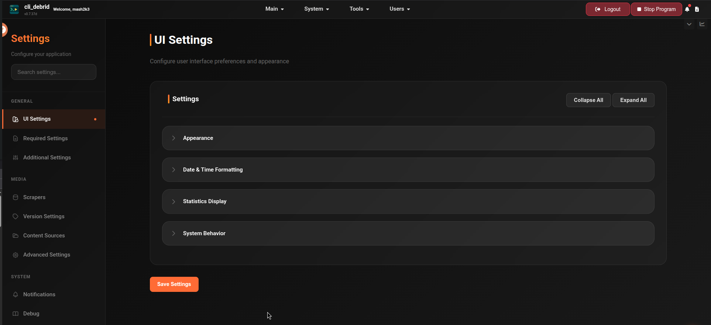

# Configuration

After completing the onboarding wizard, all settings are available in the **Settings** page. Settings are organised into tabs — each tab covers a logical group of functionality.

---

## Settings tabs

| Tab | What it covers |
|---|---|
| [UI Settings](ui-settings.md) | Theme, time format, compact view, logo, user system |
| [Required Settings](required.md) | Debrid provider, Plex/Jellyfin, file management, Trakt — must be configured to run |
| [Additional Settings](additional.md) | TMDB, Bazarr, AI Butler, OIDC/SSO, Phalanx DB |
| [Scrapers](scrapers.md) | Torrentio, Jackett, Zilean, Nyaa, MediaFusion, Prowlarr, and more |
| [Version Settings](versions.md) | Quality profiles — resolution, codec, release type preferences |
| [Content Sources](content-sources.md) | Trakt, Seerr, MDBList, Plex Watchlist, Adaptive Lists |
| [Advanced Settings](advanced.md) | Scraping behaviour, upgrading rules, filtering, queue settings, debug |
| [Notifications](notifications.md) | Discord, Telegram, Email, NTFY |
| [Manage Users](manage-users.md) | User accounts, roles, API tokens, SSO/OIDC — visible when User System is enabled |

---

## Finding settings quickly

The Settings page has a live search bar at the top. Start typing any setting name and it will instantly filter and jump you directly to the relevant field — no need to browse through tabs manually.

---

## How settings work

- Changes are applied immediately when you click **Save**
- Sensitive fields (API keys, tokens) are masked after saving
- Some settings require a program restart to take effect — these are labelled accordingly
- Settings are stored in `config/settings.json` inside your mounted config volume

!!! tip "Onboarding vs Settings"
    The onboarding wizard only covers the minimum required settings. Everything else — notifications, advanced scraping, overlays, AI Butler — is configured through the Settings page after setup.

---

## Next steps

Start with [Required Settings](required.md) to verify your core connections, then work through [Content Sources](content-sources.md) and [Scrapers](scrapers.md) to start getting content.
