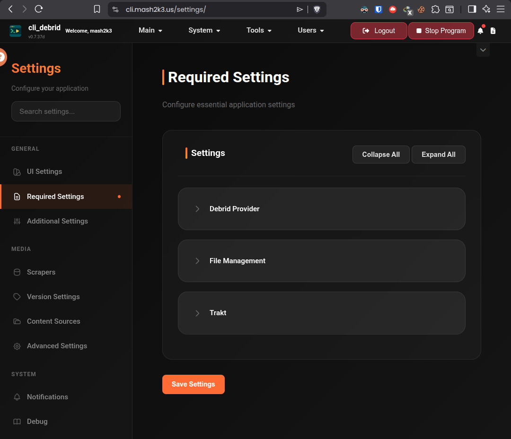

# Required Settings

These settings must be configured for cli_debrid to function. They are collected during onboarding and can be updated at any time from **Settings → Required Settings**.



---

## Debrid Provider

| Setting | Description |
|---|---|
| **Provider** | Your debrid service: Real-Debrid, AllDebrid, Premiumize, Torbox, or Debrid-Link |
| **API Key** | Your debrid API key — found in your account dashboard |

!!! tip "Getting your API key"
    === "Real-Debrid"
        Go to [real-debrid.com/apitoken](https://real-debrid.com/apitoken) while logged in.

    === "AllDebrid"
        Go to [alldebrid.com/apikeys](https://alldebrid.com/apikeys) while logged in.

    === "Premiumize"
        Go to [premiumize.me/account](https://www.premiumize.me/account) and look for **API Key**.

    === "Torbox"
        Go to [torbox.app/settings](https://torbox.app/settings) while logged in.

    === "Debrid-Link"
        Go to [debrid-link.com/webapp/apikey](https://debrid-link.com/webapp/apikey) while logged in.

---

## Plex / Jellyfin

=== "Plex"

    | Setting | Description |
    |---|---|
    | **Plex URL** | Full URL to your Plex server, e.g. `http://192.168.1.10:32400` |
    | **Plex Token** | Your Plex authentication token |
    | **Shows Libraries** | Comma-separated list of your TV library names or IDs, e.g. `TV Shows,Anime` or `2,4` |
    | **Movie Libraries** | Comma-separated list of your movie library names or IDs, e.g. `Movies,4K Movies` or `1,3` |

    !!! tip "Using library IDs"
        You can use either the library name or its numeric ID. To find the ID, open your Plex library in the browser — the `source=` value at the end of the URL is the library ID. For example, `source=1` means the library ID is `1`.

    ### Finding your Plex token

    1. Open [Plex Web](https://app.plex.tv) and browse to any media item
    2. Click the **...** menu → **Get Info** → **View XML**
    3. In the URL bar, copy the value after `X-Plex-Token=`

    Full guide: [:octicons-arrow-right-24: Plex integration](../integrations/plex.md){ .md-button }


=== "Jellyfin / Emby"

    !!! warning "Symlink mode required"
        Jellyfin and Emby do not support the Plex API. You must use **Symlinked/Local** file management mode. See [File Management](#file-management) below.

    | Setting | Description |
    |---|---|
    | **Jellyfin/Emby URL** | Full URL to your Jellyfin/Emby server, e.g. `http://192.168.1.10:8096` |
    | **Jellyfin/Emby Token** | Your Jellyfin/Emby API token |
    | **Shows Libraries** | Comma-separated list of your TV library names |
    | **Movie Libraries** | Comma-separated list of your movie library names |

    ### Getting your Jellyfin API key

    1. In Jellyfin, go to **Dashboard → API Keys**
    2. Click **+** to create a new key
    3. Name it `cli_debrid` and copy the generated key

    Full guide: [:octicons-arrow-right-24: Jellyfin integration](../integrations/jellyfin.md){ .md-button }

---

## File Management

This is one of the most important settings.

=== "Plex mode"

    cli_debrid uses the Plex API to track which files are in your library. Plex reads directly from your debrid mount.

    - Plex only — does not work with Jellyfin or Emby
    - No symlinks needed
    - Plex must be able to read the mount path

    **Mounted File Location:** Set to your debrid mount path, e.g.:

    - Zurg: `/mnt/zurg/__all__`
    - Decypharr: `/mnt/decypharr/__all__`

=== "Symlink mode"

    cli_debrid creates symlinks from the mount into an organised folder structure. Your media server scans the symlink folder.

    - Works with Plex, Jellyfin, and Emby
    - Required for Jellyfin and Emby
    - Required on Windows (use Jellyfin — Plex doesn't support symlinks on Windows)

    | Field | Value |
    |---|---|
    | **Original files path** | Your debrid mount path (e.g. `/mnt/zurg/__all__` for Zurg, `/mnt/decypharr/__all__` for Decypharr) |
    | **Symlinked files path** | Where organised symlinks go, e.g. `/mnt/symlinks` |

    !!! warning "Volume mounts must match exactly"
        In symlink mode, cli_debrid creates symlinks that point to files inside the debrid mount. For these symlinks to resolve correctly, **both cli_debrid and your media server containers must mount the debrid storage and symlink folder at identical paths**.

        For example, if cli_debrid has:
        ```
        /mnt/remotes/zurg  →  /media/mount   (debrid mount)
        /mnt/symlinks      →  /mnt/symlinked  (symlink folder)
        ```
        Then Plex/Jellyfin/Emby must have the exact same mappings:
        ```
        /mnt/remotes/zurg  →  /media/mount   (debrid mount)
        /mnt/symlinks      →  /mnt/symlinked  (symlink folder)
        ```
        If the paths differ between containers, symlinks will appear as broken files in your media server.

!!! warning "Symlinked/Local mode on Windows"
    Windows requires Developer Mode enabled for symlinks. Plex does NOT support symlinks on Windows — use Jellyfin instead.

---

## Trakt

Trakt is required for metadata lookups and content source integration.

| Setting | Description |
|---|---|
| **Client ID** | Your Trakt application Client ID |
| **Client Secret** | Your Trakt application Client Secret |

### Setting up Trakt

1. Go to [trakt.tv/oauth/applications](https://trakt.tv/oauth/applications)
2. Click **New Application**
3. Fill in a name (e.g. `cli_debrid`) and set the Redirect URI to `urn:ietf:wg:oauth:2.0:oob`
4. Copy the **Client ID** and **Client Secret** into the settings
5. Click **Authorise Trakt** in cli_debrid to complete OAuth
