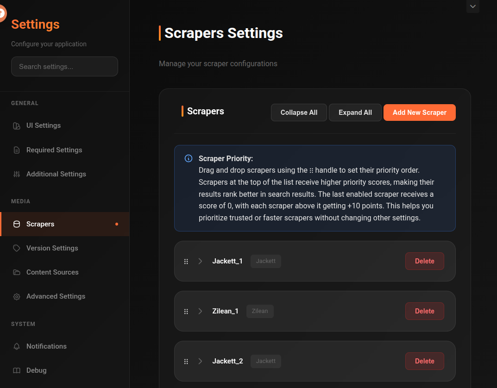

# Scrapers

Scrapers are the search engines cli_debrid uses to find torrents for your wanted items. You need at least one scraper configured and enabled.

For detailed setup guides and per-scraper documentation, see the [:octicons-arrow-right-24: Scrapers reference](../scrapers/index.md).

---

## Available scrapers

| Scraper | Type | Best for |
|---|---|---|
| [Zilean](../scrapers/zilean.md) | Debrid cache index | Fast cache lookups, upgrades |
| [Torrentio](../scrapers/torrentio.md) | Torrent metadata API | General movies and TV |
| [Jackett](../scrapers/jackett.md) | Universal indexer proxy | Any tracker via one interface |
| [Prowlarr](../scrapers/prowlarr.md) | Indexer aggregator | Multiple trackers centralised |
| [MediaFusion](../scrapers/mediafusion.md) | Metadata-based torrents | General content |
| [Nyaa](../scrapers/nyaa.md) | Anime torrents | Anime specifically |
| [AIOStreams](../scrapers/aiostreams.md) | Stream aggregator | Stream-based sources |

!!! tip "Recommended starting configuration"
    Start with **Zilean** + **Torrentio**. Zilean is fast and checks the debrid cache directly. Torrentio covers a broad range of content. Add Jackett or Prowlarr if you need specialised indexers.

---

## Adding multiple scrapers

You can enable multiple scrapers simultaneously. cli_debrid queries all enabled scrapers in parallel and combines the results, then ranks them by quality score.

---

## Scraper Priority

Scraper priority controls how much weight each scraper's results get when ranking. Scrapers at the top of the list receive higher priority scores, making their results rank better. Each scraper above the last enabled one gets +10 points added to its results score.

Use the **⠿ drag handle** to reorder scrapers — drag them up or down to set your preferred priority. Scrapers you trust most or that are fastest should go at the top.

This lets you favour specific scrapers without disabling others.
