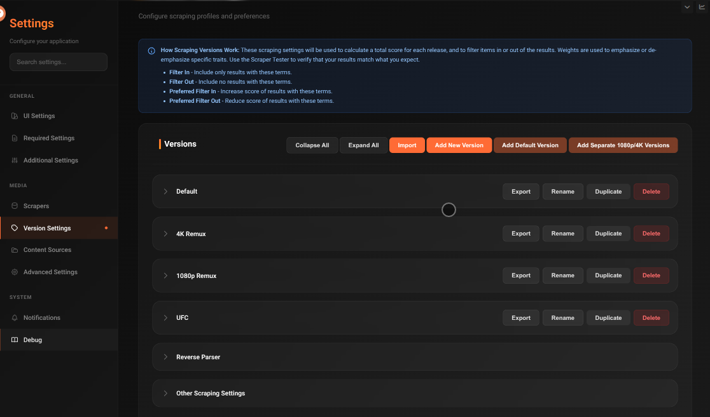
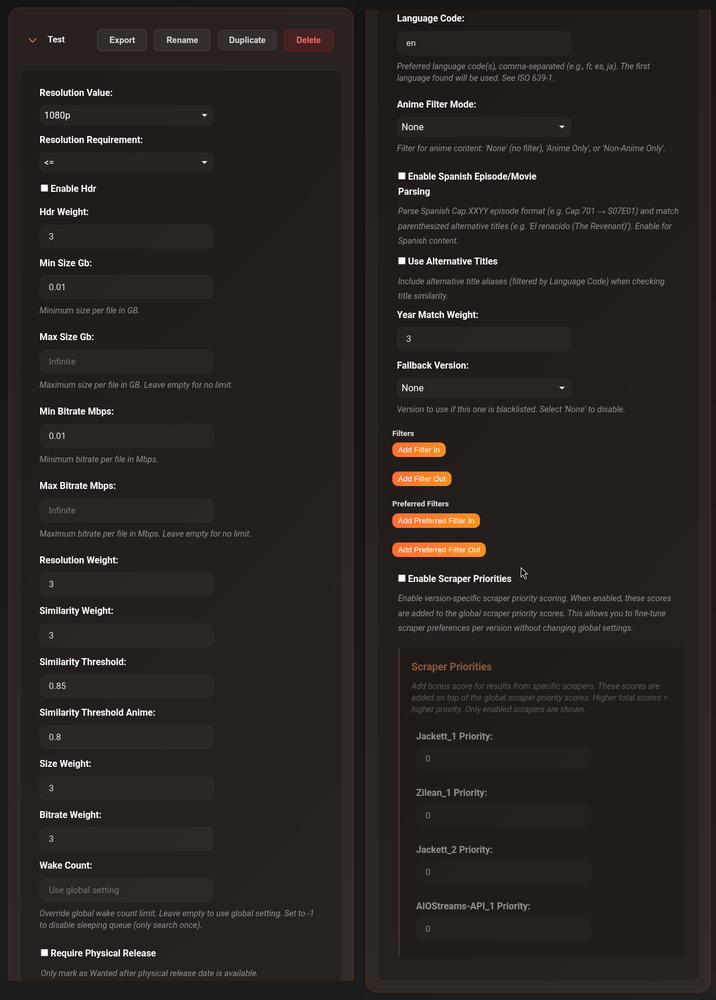
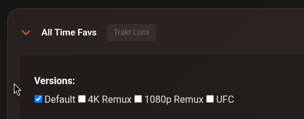

# Versions

Versions are quality profiles — they define exactly what cli_debrid should look for when scraping. Each content source is assigned a version, and cli_debrid will only accept results that match the profile's criteria.

You can create as many versions as you need and assign different ones to different content sources.

---

## Default versions

cli_debrid ships with a **Default** version pre-configured for balanced quality (1080p WEB-DL). You can edit this or create new ones.

---

## Creating a version

1. Go to **Settings → Content Sources → Versions tab**
2. Click **Add Version**
3. Give it a name (e.g. `4K HDR`, `1080p`, `Anime 720p`)
4. Configure the settings below
5. Save

---

## Resolution settings

| Setting | Options | Default | Description |
|---|---|---|---|
| **Max Resolution** | `2160p`, `1080p`, `720p`, `SD` | `1080p` | The target resolution |
| **Resolution Wanted** | `==`, `<=`, `>=` | `==` | How strictly to match the resolution |

**Resolution Wanted explained:**

- `==` — Exactly this resolution. A 1080p version will only accept 1080p files.
- `<=` — This resolution or lower. A 1080p version will accept 1080p, 720p, or SD.
- `>=` — This resolution or higher. A 1080p version will also accept 4K.

---

## HDR

| Setting | Default | Description |
|---|---|---|
| **Enable HDR** | Off | Prefer HDR content (HDR10, HDR10+, Dolby Vision, HLG) |
| **HDR Weight** | `1.0` | How much to boost the score for HDR results (higher = stronger preference) |

---

## File size

| Setting | Default | Description |
|---|---|---|
| **Min Size (GB)** | `0.0` | Reject files smaller than this. Useful to avoid low-quality small encodes. |
| **Max Size (GB)** | (no limit) | Reject files larger than this. Useful to keep storage under control. |
| **Soft Max Size** | Off | If enabled and no results fit within Max Size, accept the smallest available result instead of failing. |

---

## Bitrate

| Setting | Default | Description |
|---|---|---|
| **Min Bitrate (Mbps)** | `0.01` | Reject files below this bitrate |
| **Max Bitrate (Mbps)** | (no limit) | Reject files above this bitrate |

---

## Scoring weights

These control how much each factor contributes to the final quality score. Higher value = more important.

| Setting | Default | Description |
|---|---|---|
| **Resolution Weight** | `1.0` | How much resolution matching affects the score |
| **Similarity Weight** | `1.0` | How much title similarity affects the score |
| **Size Weight** | `1.0` | How much file size preference affects the score |
| **Bitrate Weight** | `1.0` | How much bitrate preference affects the score |
| **Year Match Weight** | `3` | How much the release year matching affects the score (default higher because wrong year = wrong content) |

---

## Title matching

| Setting | Default | Description |
|---|---|---|
| **Similarity Threshold** | `0.85` | Minimum title match score (0.0–1.0). Below this, the result is rejected. `0.85` = 85% similar. |
| **Similarity Threshold (Anime)** | `0.80` | Lower threshold for anime titles, which often have different romanisations. |

---

## Content type filter

| Setting | Options | Default | Description |
|---|---|---|---|
| **Anime Filter Mode** | `None`, `Anime Only`, `Non-Anime Only` | `None` | Restrict this version to only anime or only non-anime content |
| **Require Physical Release** | Off | — | Only accept results that have had a physical (BluRay) release |

---

## Filter terms

Use these to require or exclude specific words in torrent titles.

| Setting | Default | Description |
|---|---|---|
| **Filter In** | (empty) | Torrent title MUST contain at least one of these terms |
| **Filter Out** | (empty) | Torrent title must NOT contain any of these terms |
| **Preferred Filter In** | (empty) | Boost score if title contains these terms (soft preference) |
| **Preferred Filter Out** | (empty) | Reduce score if title contains these terms |

**Examples:**

- Filter Out: `CAM, TS, HDCAM` — reject all cam rips
- Filter In: `REMUX` — only accept remux files
- Preferred Filter In: `DV, DoVi` — prefer Dolby Vision when available
- Filter Out: `dubbed, DUBBED` — reject dubbed audio releases

---

## Language settings

| Setting | Default | Description |
|---|---|---|
| **Language Code** | `en` | Preferred language (ISO 639-1 code, e.g. `en`, `fr`, `ja`) |
| **Enable Spanish Episode Parsing** | Off | Converts Spanish episode naming (`Cap.XXYY`) to standard format |
| **Use Alternative Titles** | Off | Search using translated/alias titles for international content |

---

## Scraper priorities

| Setting | Default | Description |
|---|---|---|
| **Enable Scraper Priorities** | Off | Use different priority scores per scraper for this version |
| **Scraper Priorities** | (empty) | Per-scraper priority multipliers. Format: scraper name → score. Higher score = higher priority. |

**Example use:** Give Zilean a higher priority than Jackett for a 4K version, since Zilean is faster and checks the cache directly.

---

## Fallback version

| Setting | Default | Description |
|---|---|---|
| **Fallback Version** | None | If no results are found for this version, try this other version instead |

**Example:** Set a `4K` version's fallback to `1080p` — cli_debrid first looks for 4K, and if nothing is found, tries 1080p.

---

## Wake count

| Setting | Default | Description |
|---|---|---|
| **Wake Count** | (global setting) | How many times a sleeping item is retried before giving up. Leave empty to use the global default. Set `-1` to disable sleeping for this version entirely. |

---

## Other scraping settings

These global settings apply across all versions and control scraping behaviour, upgrading, and content filtering. They are found at the bottom of the Versions page under **Other Scraping Settings**.

### Uncached content

| Setting | Default | Description |
|---|---|---|
| **Uncached Content Handling** | `None` | How to handle uncached torrents. `None` — only take the best cached result. `Hybrid` — take the best cached result, and if no cached results are found take the best uncached result. `Full` — take the best result whether cached or uncached. |
| **Accept Uncached Within Hours** | `0` | If an item was released within the last X hours, accept uncached releases regardless of the above setting. Set to `0` to disable. |

### Scraping

| Setting | Default | Description |
|---|---|---|
| **Filter Trash Releases** | On | Filter out releases flagged as trash by the parser (typically low-quality or badly formatted releases) |
| **Minimum Scrape Score** | `0.0` | Minimum calculated score for a result to be accepted. Based on version weights. Set to `0.0` to accept any score. |
| **Scraper Timeout** | `5` | Timeout in seconds for each scraping request. Set to `0` to disable. Increase for slower scrapers like AIOStreams. |
| **Disable Adult** | On | Filter out adult content |
| **Trakt Early Releases** | Off | Check Trakt for early release information |
| **Trakt Rate Limit Enabled** | On | Enable Trakt API rate limiting to prevent 429 errors. Automatically detects VIP/Free tier. Recommended to leave enabled. |

### Upgrading

| Setting | Default | Description |
|---|---|---|
| **Enable Upgrading** | Off | Allow cli_debrid to replace a collected item with a better version if one is found |
| **Upgrading Percentage Threshold** | `0.1` | How much better a result must be to qualify as an upgrade (decimal, 0.0–1.0). `0.1` = must score at least 10% higher than the current file. |
| **Delayed Upgrade Scrape Days** | `0` | Number of days to wait before attempting a single upgrade scrape on an item. Set to `0` to disable. |
| **Enable Upgrading Cleanup** | Off | Remove the original file from your Debrid Provider after a successful upgrade |

---

## Assigning versions to content sources

Each content source has a **Versions** checkbox list. Check all versions that should apply to that source.

When multiple versions are checked, cli_debrid tries each one in priority order and uses the best match found.

---

## Version actions

At the top of the Versions page:

| Button | Description |
|---|---|
| **Import** | Import a version profile from a `.json` file |
| **Add New Version** | Create a blank version from scratch |
| **Add Default Version** | Add a pre-configured version with recommended default settings |
| **Add Separate 1080p/4K Versions** | Add two versions at once — one optimised for 1080p and one for 4K HDR |

On each individual version:

| Button | Description |
|---|---|
| **Export** | Download this version as a `.json` file to back up or share |
| **Rename** | Rename the version |
| **Duplicate** | Create a copy of the version |
| **Delete** | Permanently delete the version |

---

## Example profiles

Here are some real-world configurations from the community to show how the settings work together.

=== "Default (balanced)"

    Good starting point. Accepts 1080p and above, prefers quality groups, blocks cam rips and low-quality sources.

    | Setting | Value |
    |---|---|
    | **Max Resolution** | `1080p` |
    | **Resolution Wanted** | `>=` (1080p or higher) |
    | **HDR** | On |
    | **Min Size** | `0.01 GB` |
    | **Similarity Threshold** | `0.8` |
    | **Filter Out** | CAM, HDTS, TS, dubbed, 3D, 720p, 480p, MP4, scene site watermarks |
    | **Preferred Filter In** | REMUX (1000), 2160p (500), FGT/FraMeSToR (quality groups), HDR variants |
    | **Preferred Filter Out** | Upscaled, torrenting site watermarks |

=== "1080p (strict)"

    Exact 1080p only — no 4K, no HDR, no x265. High weight on size and bitrate. Falls back to 720p if nothing found.

    | Setting | Value |
    |---|---|
    | **Max Resolution** | `1080p` |
    | **Resolution Wanted** | `==` (exact) |
    | **HDR** | Off |
    | **Min Size** | `0.2 GB` |
    | **Fallback Version** | `720p` |
    | **Similarity Threshold** | `0.9` |
    | **Filter Out** | HDR, 3D, YTS, MULTI, x265/HEVC, AV1, dubbed audio groups |
    | **Preferred Filter In** | Premium release groups (FraMeSToR 800, FLUX/FGT 600), streaming sources (AMZN, NF, ATVP) |
    | **Preferred Filter Out** | AV1 (500), x265/HEVC (400+), foreign dub groups |

=== "4K Remux"

    Strict 4K remux only. Requires `REMUX` in the title. High size weight to prefer larger, higher quality files. Zilean and Jackett get priority.

    | Setting | Value |
    |---|---|
    | **Max Resolution** | `2160p` |
    | **Resolution Wanted** | `==` (exact) |
    | **HDR** | On |
    | **Min Size** | `0.1 GB` |
    | **Filter In** | `REMUX` (required) |
    | **Preferred Filter In** | REMUX (1000), 2160p (500), FGT/FraMeSToR quality groups |
    | **Scraper Priority** | Zilean (1000), Jackett (1000) — prioritise cache and direct indexer |

=== "2160p HDR"

    Targets 2160p and above with strong HDR preference. High resolution weight, prefers REMUX and premium encode groups. Blocks SDR, dubbed, WEBRip, and upscales.

    | Setting | Value |
    |---|---|
    | **Max Resolution** | `1080p` |
    | **Resolution Wanted** | `>=` (1080p or higher) |
    | **HDR** | On |
    | **Resolution Weight** | `100` (dominant factor) |
    | **HDR Weight** | `20` |
    | **Wake Count** | `48` (retries many times before giving up) |
    | **Filter Out** | CAM, Telesync, 3D, upscaled variants |
    | **Preferred Filter In** | REMUX (200), HDR10+/DV variants (50), TRUEHD/ATMOS (30), IMAX (30) |
    | **Preferred Filter Out** | SDR (10), dubbed (30), WEBRip (50) |

---

## Tips from the community

- **Boost resolution weight** (e.g. `100`) if you want resolution to dominate all other scoring factors
- **High size weight** (e.g. `10–15`) helps pick larger, higher-bitrate files over compressed encodes
- **Filter In: REMUX** is the most reliable way to guarantee a remux-only version — don't rely on preferred filters alone
- **Preferred Filter In with high scores** (500–1000) for trusted release groups acts as a soft allowlist without blocking everything else
- **Fallback versions** are essential for strict profiles — a `4K Remux` version with no fallback will leave items sleeping if no remux exists
- **Wake Count** `0` uses the global default; set `-1` to disable sleeping entirely for a version; set higher (e.g. `48`) for rare content that needs more retries

---

## Community versions

The cli_debrid Discord has a dedicated channel where users share and download version profiles. You can export your version and drop it in the channel, or grab one optimised for a specific use case (4K HDR, remux only, anime, small sizes, etc.).

[:fontawesome-brands-discord: Browse & share version profiles](https://discord.com/channels/691282102162948107/1478610851433807953){ .md-button }
