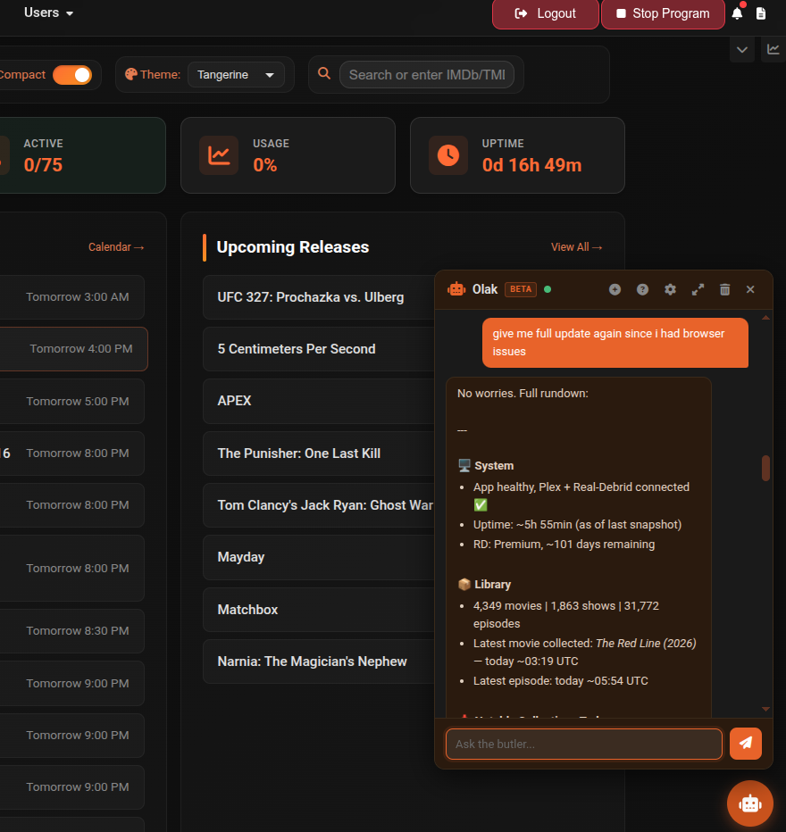
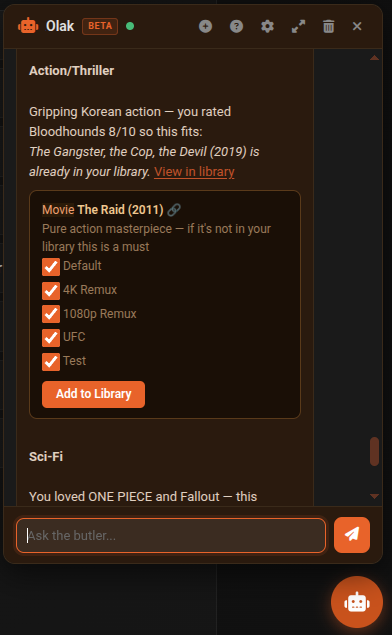
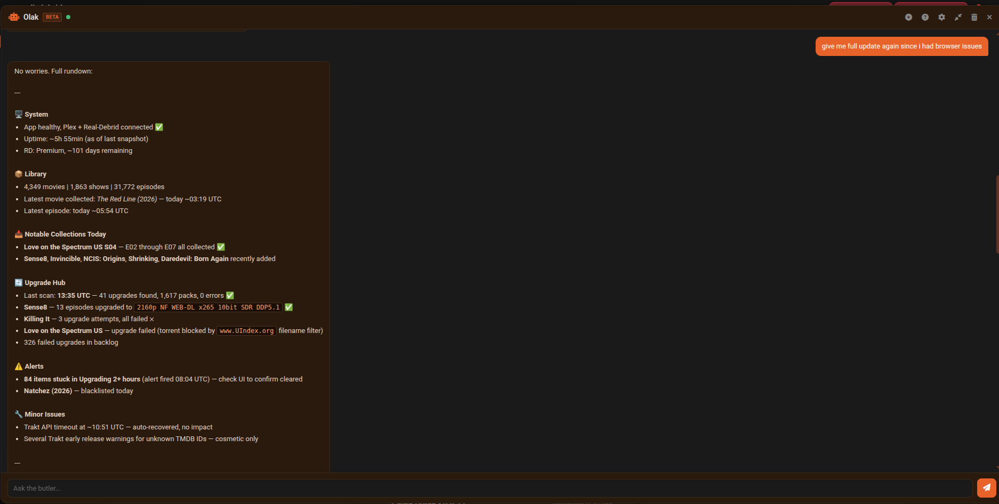

# AI Butler

The AI Butler is a floating chat assistant powered by your self-hosted OpenClaw instance. It has live access to your cli_debrid data — queues, library, settings, health stats, and watch history — and can answer questions, diagnose issues, suggest fixes, and take actions on your behalf.

!!! note "Requires OpenClaw"
    The AI Butler requires a self-hosted [OpenClaw](../integrations/openclaw.md) instance ([docs.openclaw.ai](https://docs.openclaw.ai)). OpenClaw handles AI provider selection and session memory.

!!! tip "Paid AI API recommended"
    Works best with a paid AI API (e.g. OpenAI, Anthropic, Gemini). Free tier models may lack the context window or tool-calling capability needed for reliable responses.

---

## Setup

1. Deploy an OpenClaw instance — see the [:octicons-arrow-right-24: OpenClaw integration guide](../integrations/openclaw.md)
2. Go to **Settings → Additional Settings → AI Assistant**
3. Enter your **OpenClaw URL** and **Bearer Token**
4. Set **Agent ID** (default: `main`) and **Display Name** to match your agent's name
5. Toggle **Enable AI Butler** on
6. Save Settings — the status dot turns green if the connection succeeds

---

## Opening the Butler

Click the robot icon in the bottom-right corner of any page to open or close the chat panel. The panel state is remembered across page loads.

---

## Chat

Type your question or request and press **Enter** (or **Shift+Enter** for a new line). The assistant responds using real-time streaming.

Examples of things you can ask:

- *"Why is my queue stuck?"*
- *"What's my current download count?"*
- *"Recommend some action movies I haven't seen"*
- *"Turn on debug logging for the scraper"*
- *"Run the upgrade scan"*
- *"How much memory is the app using?"*
- *"What movies have I added recently?"*

---

## Header buttons

| Button | Description |
|---|---|
| **+ (New Session)** | Start a fresh session — clears OpenClaw's server-side memory and your local chat history. Use this when switching topics. |
| **? (Help)** | Opens the in-app help page |
| **⚙ (Settings)** | Opens the AI Assistant settings modal directly from the chat — no need to navigate to Settings |
| **Expand / Compress** | Toggle between default size and full-screen view. Useful for long responses or recommendation lists. |
| **Trash (Clear)** | Clears local chat display and stored message history without resetting the server-side session. Tidies the chat without losing the AI's memory context. |
| **X (Close)** | Closes the panel without clearing anything |
| **Status dot** | Green = connected, Red = unreachable, Grey = disabled |

---

## Action cards

The AI Butler produces interactive cards inline in the chat:

**Apply Setting card** — When the AI suggests changing a setting, it shows an **Apply** button. Clicking it saves the setting immediately. If the change requires a program restart, a **Restart** button appears.

**Add to Library card** — When the AI recommends content, it shows a card with an **Add to Library** button. Clicking it adds the title to your Wanted list via Trakt lookup. Items already in your collection show a **View in Library** link. Uncollected titles link to the Discover page.

---

## What the AI knows

The AI receives a system prompt on each message that includes:

| Context | Description |
|---|---|
| **Queue state** | Counts, recent errors, program running status |
| **Key settings** | Scraper config, content sources, version config summary (tokens redacted) |
| **Health metrics** | Memory usage, blacklist rate, error rate |
| **Library summary** | Movie/show/episode counts, recent additions |
| **Watch history & ratings** | When Content Recommendations is enabled |
| **Collected IMDB IDs** | For recommendation filtering |
| **Habit patterns** | When Habit Learning is enabled |
| **Full config + logs** | When Share Full Config is enabled (secrets always redacted) |

---

## Feature toggles

| Toggle | Default | Description |
|---|---|---|
| **Settings Assistant** | On | Allow the Butler to suggest and apply settings changes via `APPLY_SETTING` cards |
| **Proactive Notifications** | On | Run background health checks and push alerts to your notification channels |
| **Content Recommendations** | On | Include watch history and library context for personalised suggestions with Add to Library buttons |
| **Habit Learning** | On | Record usage patterns and surface summaries to the AI for better context |
| **Health Notifications** | On | Send proactive alerts when health issues are detected |
| **Share Full Config with AI** | On | Send full config and logs (secrets always redacted). When off, only brief excerpts are sent. |

For full setting descriptions see [Additional Settings → AI Assistant](../configuration/additional.md#ai-assistant).

---

## Proactive health checks

When **Proactive Notifications** is enabled, the AI Health Monitor runs in the background and automatically pushes plain-English alerts to your configured notification channels (Telegram, Discord, etc.) when it detects:

- Stuck queue (items not moving for 2+ hours)
- High blacklist rate
- High error rate
- Stalled upgrading items
- Database growing very large

---

## Important notes

- The OpenClaw URL must be reachable from **inside the cli_debrid Docker container**, not just from your browser. If you use a reverse proxy or Tailscale, use the internal/container-reachable address.
- OpenClaw handles all AI provider credentials — cli_debrid never sees your API keys.
- Session memory is scoped per session ID. Starting a new session clears the AI's memory of your conversation but does not affect your library or settings.
- The AI cannot delete media items or modify the database directly. It can trigger program actions (start/stop queue, run tasks, scan library) but these are the same actions available in the UI.

---

## Tips

- Use **New Session** (+) when switching topics to avoid prior context influencing responses.
- Use **Expand** to go full-screen when reviewing long recommendation lists or detailed diagnostics.
- For setting changes, the AI's Apply cards are safer than editing settings manually — the AI explains the reason before applying.
- If the status dot is red, check that OpenClaw is running and that the URL and token in settings are correct. Verify with `curl http://your-openclaw-url/healthz`.

