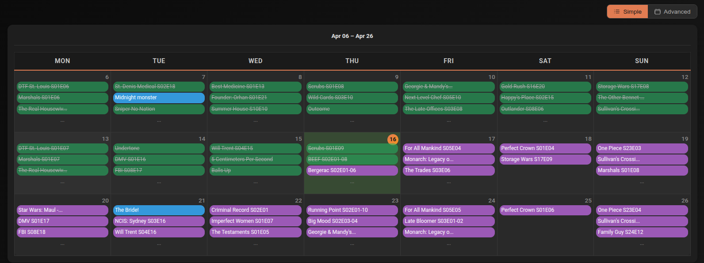
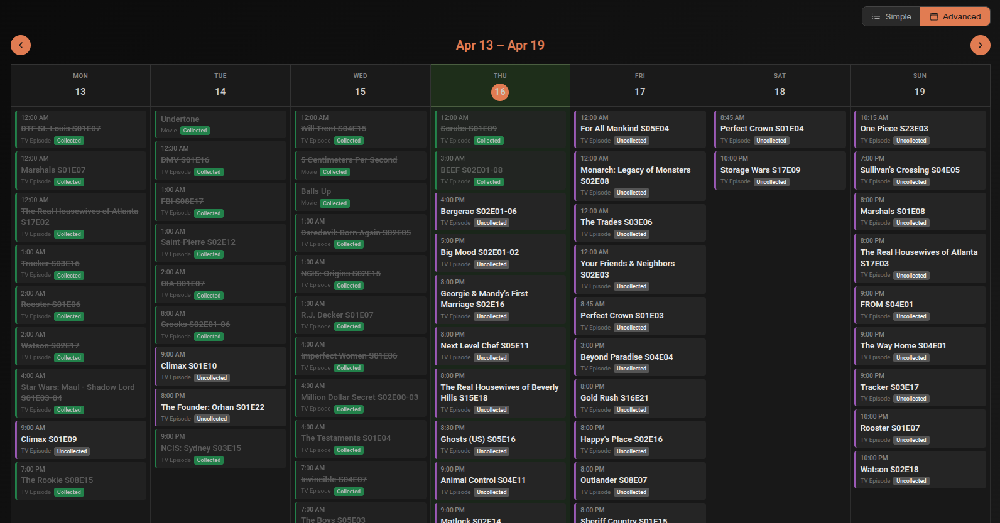

# Calendar

The Calendar shows upcoming and recent media events — episodes airing soon, movies releasing, and what's already been collected — in a visual calendar format.

Access it from the **Calendar →** links on the [Dashboard](dashboard.md)'s Recently Aired and Airing Soon sections, or directly from the navigation.

---

## Views

Toggle between two views using the **Simple** and **Advanced** buttons. Your preference is remembered across page loads.

=== "Simple"

    A 3-week grid showing Mon–Sun columns with events per day. Up to 3 events are shown per cell — if there are more, a `...` indicator appears.

    Below the grid, a **timeline** shows events for yesterday, today, and tomorrow in chronological order with time, title, category, and status badge.

    Click any day cell to open a modal showing all events for that day.

    

=== "Advanced"

    A full week view with slide animation when navigating between weeks. Navigate up to 2 weeks forward or backward using the **← →** buttons.

    On mobile, switches to a single-day view — use the day navigation arrows to move between days.

    

---

## Event data

Each event shows:

- **Time** — scheduled air time or release time (or "All Day" if no specific time)
- **Title** — movie or episode name
- **Category** — Movie or TV Episode
- **Status badge** — colour-coded based on current state (collected, checking, not started, etc.)

---

## Clicking an event

| Item state | Where it links |
|---|---|
| Collected, Upgrading, Checking Upgrade | Opens the item in the [Library](library.md) |
| Not yet collected (has TMDB/IMDB ID) | Opens the item in [Discover](discover.md) details |
