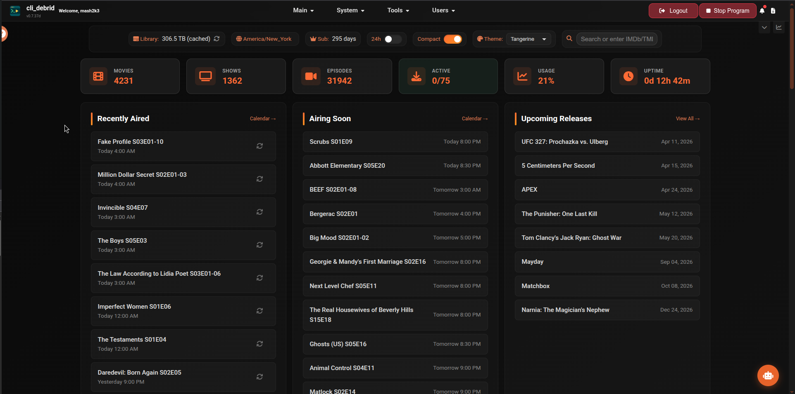
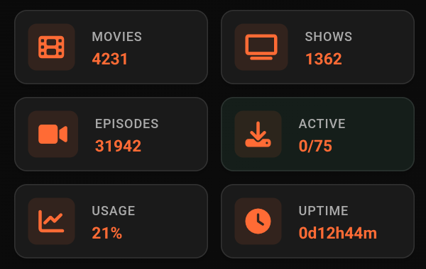

# Dashboard

The Dashboard is the home screen of cli_debrid. It gives you a real-time snapshot of your collection, active downloads, and what's airing soon.

---

## Statistics cards

The top row shows summary counts for your entire library:

| Card | Description |
|---|---|
| **Movies** | Total collected movies — click to open the [Movies library](library.md) |
| **Shows** | Total TV shows with at least one collected episode — click to open the [Shows library](library.md) |
| **Episodes** | Total collected episodes |
| **Active Downloads** | Current downloads / max slot limit — click to open the [Debrid Manager](debrid-manager.md) Active tab |
| **Usage** | Current debrid storage usage — click to open the [Debrid Manager](debrid-manager.md) Usage tab |
| **Uptime** | How long cli_debrid has been running since last restart — click to open the [Performance Dashboard](performance.md) |

---

## Recently Aired

Episodes from your collected TV shows that aired recently. Each entry shows the episode title, season/episode number, and air time.

| Status | Meaning |
|---|---|
| Normal text | Episode is collected |
| Dimmed text | Episode is not yet collected |
| Checking upgrade style | Episode is currently being checked for an upgrade |

Each episode has action buttons depending on its status:

| Button | Appears when | Action |
|---|---|---|
| **Search** (magnifying glass) | Uncollected or checking upgrade | Manually trigger a search for this episode |
| **Refresh** (up arrow) | Checking upgrade only | Move back to Wanted state |
| **Rescrape** (circular arrow) | Collected | Re-queue for a fresh scrape |

Click any episode to open the show detail page. The **Calendar →** link opens the full [Calendar view](../features/dashboard.md).

---

## Airing Soon

Episodes from your collected shows scheduled to air in the coming days. Useful for seeing what cli_debrid will be looking for shortly. Shows the episode title and scheduled air time.

Click any episode to open the show detail page. The **Calendar →** link opens the full Calendar view.

---

## Upcoming Releases

Movies with known upcoming release dates. Shows the title and release date. Click any item to open its detail page.

The **View All →** link opens the [Library](library.md) filtered to upcoming releases.

---

## Recently Added Movies & Shows

Poster cards for the most recently collected movies and TV show episodes. Each card shows:

- Title and year
- Season/Episode number (shows only)
- Version, file size, and collection date (shown on hover, or always visible in Compact View)
- Filename

Click any card to open the item's detail page. The **View All →** link opens the [Library](library.md) filtered to recently added.

---

## Recently Upgraded

Poster cards for items that were recently upgraded to a better quality version. Each card shows:

- Title, version, size, and upgrade date
- **From:** the previous file
- **To:** the new upgraded file

Click any card to open the item's detail page. The **View All →** link opens the [Library](library.md) filtered to upgraded items.

---

## View options

- **Compact view** — reduces card spacing for a denser layout (toggle in Settings → UI Settings)
- **Time format** — switch between 12-hour and 24-hour display
- The dashboard auto-refreshes in the background — no manual reload needed
