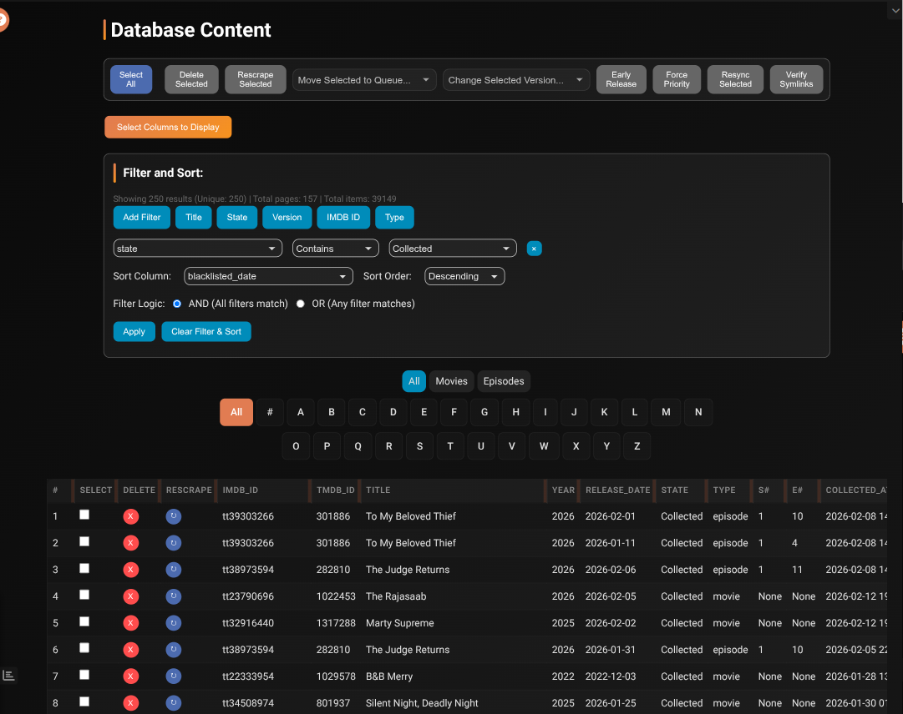

# Database Browser

The Database Browser lets you view, filter, sort, and take actions on every item in your media library directly — without needing a separate SQLite tool. It's the go-to place for bulk operations and inspecting item states.

---

## Views

The Database Browser has two views toggled from the header:

**Table view** — the default. Full filtering, sorting, column customisation, and bulk actions.

**Visual Grid view** — poster card layout. Search by title and scroll through your library visually. Cards show poster, title, year, and type.

---

## Stats panel

Click the chart icon to expand the Stats panel showing total Movies, Shows, and Episodes in your database.

---

## Content type & alphabet filters

| Filter | Options |
|---|---|
| **Content type** | All, Movies, Episodes |
| **Alphabet** | All, #, A–Z — jump to items starting with that letter |

---

## Advanced filtering

Click **Add Filter** to build multi-condition filters. Quick filter buttons for common columns (Title, State, Version, IMDB ID, Type) are also available.

| Filter option | Description |
|---|---|
| **Column** | Any column in the table |
| **Operator** | contains, equals, greater than, less than, etc. |
| **Value** | Text input or dropdown (pre-populated for State, Type, Version, Content Source, Upgraded, Early Release) |
| **Logic** | AND (all filters must match) or OR (any filter matches) |

---

## Sorting

Use the **Sort Column** dropdown and **Ascending / Descending** toggle. Click **Apply** to update results.

---

## Column customisation

Click **Select Columns to Display** to open the column manager:

- Move columns between **Available** and **Selected** lists
- Reorder selected columns with the ▲ ▼ buttons
- Drag column headers to resize widths
- All choices persist in your browser (localStorage)

**Available columns:** id, imdb\_id, tmdb\_id, title, year, release\_date, state, type, episode\_title, season\_number, episode\_number, airtime, collected\_at, version, content\_source, upgraded, early\_release, size

---

## Per-item actions

Each row has inline action buttons:

| Action | Description |
|---|---|
| **Delete (×)** | Remove item from the database. Optionally blacklist to prevent re-adding. |
| **Rescrape (↻)** | Delete and move back to the Wanted queue for a fresh scrape |

---

## Bulk operations

Select items using checkboxes. Use **Shift+click** to select a range. Then choose an action from the bulk action bar:

| Action | Description |
|---|---|
| **Delete Selected** | Remove all selected items. Optionally blacklist. |
| **Rescrape Selected** | Move all selected back to Wanted |
| **Move to Queue** | Move all selected to a specific queue state |
| **Change Version** | Apply a different quality profile to all selected |
| **Early Release** | Flag selected items for early-release handling |
| **Force Priority** | Mark items to jump to the front of the queue |
| **Resync Selected** | Resync symlinks and database paths for selected items |
| **Verify Symlinks** | Add selected items to the symlink verification queue |

!!! tip "Select across all pages"
    After clicking **Select All**, a **Select all N matching** button appears to select every item matching the current filter — not just the visible page.

Bulk operations are batched (450 items per batch) to avoid database lock issues.

---

## Item states

| State | Meaning |
|---|---|
| **Wanted** | Waiting to be scraped — will be processed next cycle |
| **Scraping** | Currently being searched |
| **Adding** | Torrent found, being submitted to debrid |
| **Checking** | Waiting for file to appear at mount |
| **Collected** | In your library |
| **Sleeping** | All known torrents blacklisted — waiting to retry |
| **Blacklisted** | Torrent blacklisted for this item |
| **All Versions Blacklisted** | Every version has been blacklisted |
| **Unreleased** | Release date not yet reached — will auto-move to Wanted on release |
| **Pending Uncached** | Waiting for an uncached download slot |
| **Upgrading** | Better version being sought |
| **Final Scrape** | One last scrape attempt before blacklisting |
| **Ghostlisted** | Soft-deleted — hidden from library but preserved in the database |

---

## Common tasks

### Finding a stuck item

1. Filter by **State** → select the stuck state (e.g. Sleeping)
2. Search for the title
3. Use **Rescrape** to retry, or **Move to Queue** to force a state

### Bulk-clearing sleeping items

1. Filter by **State = Sleeping**
2. Click **Select All** then **Select all N matching**
3. Click **Move to Queue** → **Wanted**

### Removing a show completely

1. Filter by title
2. Select all episodes and the show entry
3. Click **Delete Selected**
4. Check **Blacklist** if you don't want it re-added from content sources

### Fixing an incorrect episode number

1. Find the item in the database
2. Note the Item ID
3. Go to **Debug Functions → Fix Episode Numbers**
4. Enter the Item ID and correct episode number
