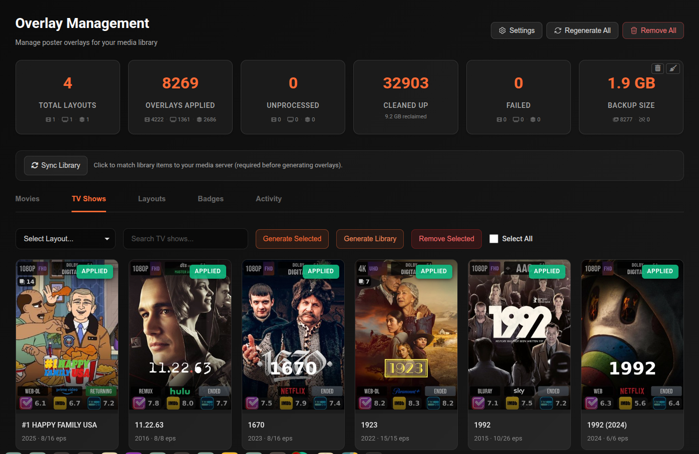
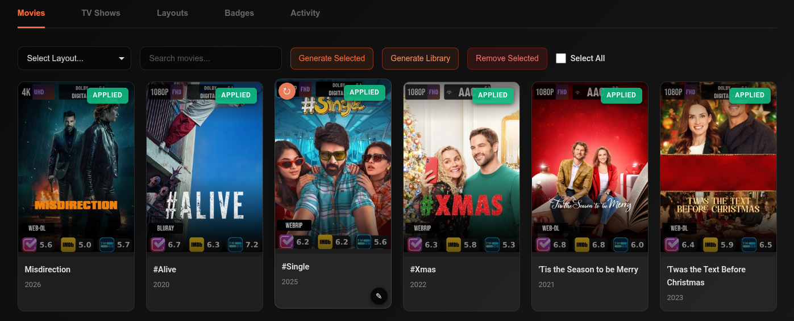
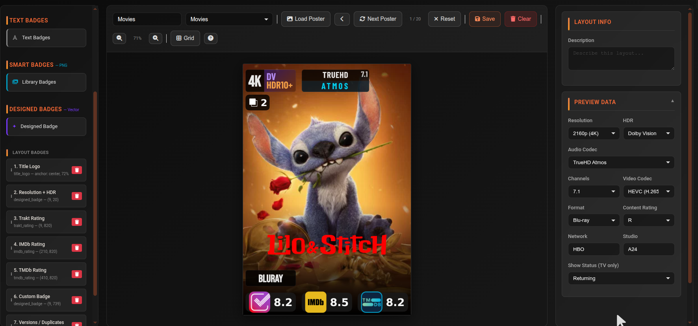

# Poster Overlays

The Overlay system automatically adds informational badges to your poster artwork — resolution, HDR format, audio codec, ratings, and more. These display in Plex on top of your existing posters.

---

## How it works

1. **Sync Library** — cli_debrid matches its database items to Plex using IMDB/TMDB IDs
2. For each matched item, a customised poster is generated with badges applied
3. The modified poster is uploaded back to Plex, replacing the original
4. Original posters are backed up and can be restored at any time

---

## Statistics cards

The top row shows a live summary of your overlay state:

| Card | Description |
|---|---|
| **Total Layouts** | Number of layouts defined, broken down by Movie/Show/Season |
| **Overlays Applied** | Items with an active overlay, broken down by type |
| **Unprocessed** | Items not yet processed — click to filter the grid to these items |
| **Cleaned Up** | Disk space reclaimed from old overlay files. Click ↺ to reset the counter. |
| **Failed** | Items where overlay generation failed — click to filter. Click ↺ to retry all. |
| **Backup Size** | Total size of backed-up original posters and orphaned backup count. Use the trash button to clean up orphaned backups, or the broom button to delete all backups and reset overlays to pending. |

---

## Sync Library

Before overlays can be applied, cli_debrid must match its database items to Plex entries using IMDB/TMDB IDs. Click **Sync Library** to run a full sync.

Required:

- After first enabling overlays
- After adding large amounts of new content
- If overlays stop applying to certain items

A title+year fallback is used for items without IMDB/TMDB GUIDs.

---

## Movies tab

Shows all movies in a poster grid with their current overlay status.

| Status badge | Meaning |
|---|---|
| **Applied** | Overlay is active on this poster |
| **Pending** | Queued for generation |
| **Failed** | Generation failed — reason shown below the poster |
| **Not Started** | Not yet queued |

**Controls:**

| Button | Description |
|---|---|
| **Layout selector** | Choose which layout to use when generating |
| **Generate Library** | Generate overlays for ALL movies in the database |
| **Generate Selected** | Generate overlays for checked items only |
| **Remove Selected** | Remove overlays and restore original posters for checked items |
| **Select All** | Select all visible items |

**Per-card actions (on hover):**

| Button | Description |
|---|---|
| **↻ Regenerate** | Regenerate this poster's overlay using the current library poster |
| **✎ Poster Picker** | Choose an alternative poster from TMDB, then apply overlay on top |

Click a card to select/deselect it. Items with multiple versions show a version count badge.

The grid shows up to 300 items — use search to refine when your library is larger.

---

## TV Shows tab

Same as Movies with two additional features per show card:

- **Seasons button** — opens the Season Overlays modal to manage per-season posters
- **Unprocessed seasons badge** — shows which season numbers still need overlays (e.g. `S1 · S2 unprocessed`). Click to open the Season modal directly.

### Season Overlays modal

Manage poster overlays for individual seasons of a show. Select a layout (or use Auto to pick the best available) and click **Generate Library** to apply across all seasons for all shows.

---

## Layouts tab

Create and manage overlay layout configurations. A layout defines which badges to show, where they are positioned, and their visual style.

**Layout actions:**

| Button | Description |
|---|---|
| **Create Layout** | Open the layout builder to create a new layout from scratch |
| **Import Layout** | Import a layout from a JSON file |
| **Load Default Layouts** | Import any missing built-in defaults (Movies, Shows, Seasons) |

Each layout card shows its name, description, type, and active status.

**Per-layout actions:** Edit, Deactivate / Set Active, Duplicate, Export, Delete

Different layouts can be assigned to Movies, Shows, and Seasons independently.

---

## Layout Builder

The Layout Builder lets you design overlay layouts by placing and configuring badges on a live preview canvas.

### Badge types

There are five distinct badge categories in the palette, each working differently:

**Tray**

A background panel with no content of its own. Place a tray behind other badges to create a unified strip or box — typically at the bottom of the poster. Supports solid or gradient fills, borders, border radius, and opacity control.

---

**Text Badges**

The most versatile type. Renders text onto the poster using a `{{variable}}` template. Supports a background box, an optional icon to the left or right, full font customisation (family, size, weight, colour, alignment), and vertical stacking for two-line labels.

Presets cover every common data type — select from the **Badge Type** dropdown:

| Preset | What it shows |
|---|---|
| IMDb / TMDb / Trakt Rating | Rating score with service logo |
| RT Critics / RT Audience | Rotten Tomatoes score |
| Resolution | `4K`, `1080p`, `720p`, etc. |
| HDR Format | `DV`, `HDR10+`, `HDR10`, `HLG` |
| Audio Codec | `TrueHD Atmos`, `DTS:X`, `DD+`, etc. |
| Audio Channels | `7.1`, `5.1`, `2.0` |
| Video Codec | `HEVC`, `AVC`, `AV1` |
| Format / Source | `REMUX`, `WEB-DL`, `WEBRip`, `HDTV` |
| Network | TV network name |
| Studio | Production studio name |
| Content Rating | `PG-13`, `TV-MA`, `R`, etc. |
| Show Status | `Returning`, `Airing`, `Ended`, `Canceled` |
| Versions / Duplicates | Count shown only when multiple versions exist |
| Custom Badge | Any combination of static text and `{{variables}}` |
| **File Match** | Conditional — see below |

---

**Smart Badges (Library Badges)**

Image-based badges. Instead of rendering text, the system selects a matching PNG image from your **Badge Library** (`/overlays/badges`) automatically based on the item's metadata. You control the size and position in the layout; the correct image is chosen at render time. If no matching asset exists for a given item, the badge is silently skipped.

Badge Library categories and their available slots:

| Category | Slots |
|---|---|
| **Audio Codec** | AAC, Dolby Atmos, Atmos Standalone, DD+ Atmos, Dolby Digital, Dolby Digital+, DTS, DTS-ES, DTS-HD, DTS-HD HRA, DTS-HD MA, DTS:X, FLAC, MP3, PCM, TrueHD, TrueHD Atmos |
| **Video Codec** | AV1, AVC, HEVC, VP9 |
| **Resolution** | 480p, 720p, 1080p, 2160p/4K |
| **HDR Format** | Dolby Vision, DV+HDR, DV+HDR10, DV+HDR10+, HDR, HDR10, HDR10+, HLG |
| **Format / Source** | Blu-ray, DVD, HDTV, WEB-DL, WEBRip |

Upload your own PNG badge images via the **Badges** tab or at `/overlays/badges`. Each slot can have one image — upload to the slot that matches the metadata value you want to display. Custom variation slots can be added for metadata values not in the default list.

---

**Designed Badges**

Procedurally rendered vector badges — no image uploads required. Each preset generates a styled badge at render time using the item's actual metadata. Select a preset from the dropdown to control what data is shown:

| Preset | What it shows |
|---|---|
| Custom (manual text) | Static text or custom layout you configure manually |
| Resolution + HDR | Resolution and HDR type combined in one badge |
| Resolution | Video resolution only |
| HDR Format | HDR type only |
| Audio Codec | Audio codec name |
| Audio Channels | Channel layout only |
| Audio Codec + Channels | Codec and channels side by side |
| Audio Stacked (codec / channels) | Codec and channels stacked vertically |
| Video Codec | Video codec name |
| Format / Source | Release source (e.g. `REMUX`, `WEB-DL`) |
| IMDb Rating | IMDb score |
| TMDb Rating | TMDb score |
| Trakt Rating | Trakt score |
| RT Critics | Rotten Tomatoes critics score |
| RT Audience | Rotten Tomatoes audience score |
| Network | TV network name |
| Studio | Production studio name |
| Content Rating | MPAA/TV content rating |
| Show Status | Current show status |
| Versions / Duplicates | Version count badge |

---

**Title Logo**

Renders the title onto the poster. When **Enable Textless Posters** is on and a textless poster is found, the title is rendered as a clearlogo PNG from TMDB — the official transparent title treatment. If no clearlogo exists, falls back to text in the configured font. This is the main reason to use textless posters: place the title exactly where you want it rather than relying on the baked-in title from a standard poster.

---

### File Match badge

The **File Match** badge is useful for flagging attributes that aren't available as standard metadata — for example, `EXTENDED`, `DIRECTOR'S CUT`, `REMASTERED`, or a specific encode group present in the filename.

**How it works:**

1. Add a Text Badge and set the type to **File Match**
2. Enter a **Search Term** — the badge only renders if this text is found in the video filename (case-insensitive)
3. Optionally enter a **Display Text** — shown on the badge instead of the search term. Leave empty to use the search term itself.
4. Toggle **Use icon instead of text** to show an icon (configured in the Icon section) rather than text

Use the **Background**, **Icon**, and **Text / Value** sections to style the badge exactly as you would any other badge. The canvas preview always shows the badge so you can design its appearance.

**Examples:**

- Search term `REMUX` → badge appears only on remux files, displaying `REMUX`
- Search term `extended`, display text `Extended Cut` → styled label on extended editions only
- Search term `x265` with an icon → icon badge visible only on x265 encodes

---

## Badges tab

Browse and manage badge PNG assets. Badges are auto-selected at render time based on the media item's metadata (codec, resolution, HDR format, etc.).

Shows a summary of badge types, total variations, and uploaded assets. Click **Open Badge Library** to manage badge assets at `/overlays/badges`.

---

## Activity tab

A chronological audit log of all overlay operations.

Filter by action type:

- Overlay Sync, Cleanup
- Generate / Regenerate / Generate All / Regenerate All
- Remove / Remove All
- Layout Created / Updated / Deleted
- Sync Library
- Season Generate / Regenerate / Remove
- Poster Reset

Entries are paginated (50 per page) and colour-coded by result (success, failed, partial).

---

## Settings

Overlay settings are accessible directly from the **Overlay Management** page via the **Settings** button in the top action bar — no need to navigate to the Settings menu.

Click **Settings** (top right of the Overlay Management page) to open the Overlay Settings modal:

| Setting | Default | Description |
|---|---|---|
| **Enable Overlay System** | Off | Master toggle. When enabled, overlay sync tasks run automatically and apply media info badges to Plex posters. Requires Plex URL and token to be configured. |
| **Enable Textless / Clean Posters** | Off | When enabled, cli_debrid fetches a language-neutral (textless) poster from TMDB as the base image — these have no baked-in title text so the **Title Logo** badge can render cleanly at your chosen position. Use the Title Logo badge in the layout editor to add the show or movie title as a transparent clearlogo PNG (with text fallback if no clearlogo exists). The Title Logo badge is only available in the layout editor when this setting is on. **Note:** Not all titles have textless posters on TMDB — if none is found, the standard English poster is used as fallback. |
| **Media Server Data Path** | `/plex_data` | Path to the Plex Media Server data directory. Required for the poster cleanup task to delete old uploaded overlay versions directly from the filesystem. |
| **Ratings Check Interval (days)** | `7` | How often to re-fetch ratings (IMDb/TMDB/Trakt/RT) and show status to detect changes. Set to `0` to check every sync run. Version count changes are always checked every sync regardless of this setting. |
| **Items Per Sync Run** | `200` | Maximum number of shows/movies processed per overlay sync run. Higher values clear backlogs faster but each run takes longer (~1s per item). |

**Poster Reset:**

Use these when migrating from another overlay app (Kometa, PMM, etc.) or to clear any foreign overlays. Overlays will **not** be re-applied automatically after a reset — use **Generate All** when ready.

| Option | Description |
|---|---|
| **Reset All Posters** | Reset ALL posters to clean originals from TMDB |
| **Review & Reset Selected** | Opens a selective grid to choose specific items to reset |

---

## Top-level actions

| Button | Description |
|---|---|
| **Regenerate All** | Force re-render all overlays for movies, shows, and seasons — overwrites existing |
| **Remove All** | Remove all overlays from the entire library and restore original posters |

Long-running operations show a **Task Progress** overlay with a live progress bar, item counter, and failure count. Click **Continue in background** to hide the modal while the task runs.

---

## Automatic regeneration

When overlays are enabled, newly collected items are automatically queued for overlay generation. Configure the check interval via the **Settings** button on the Overlay Management page, or under **Settings → Additional Settings → Overlay Settings → Ratings Check Interval**.

!!! info "Scheduled tasks"
    | Task | Default interval |
    |---|---|
    | **Overlay Sync** | Every **1 hour** |
    | **Overlay Cleanup** | Every **24 hours** |

    Adjust intervals or trigger manually in the [Task Manager](task-manager.md) under the **Features** tab.
