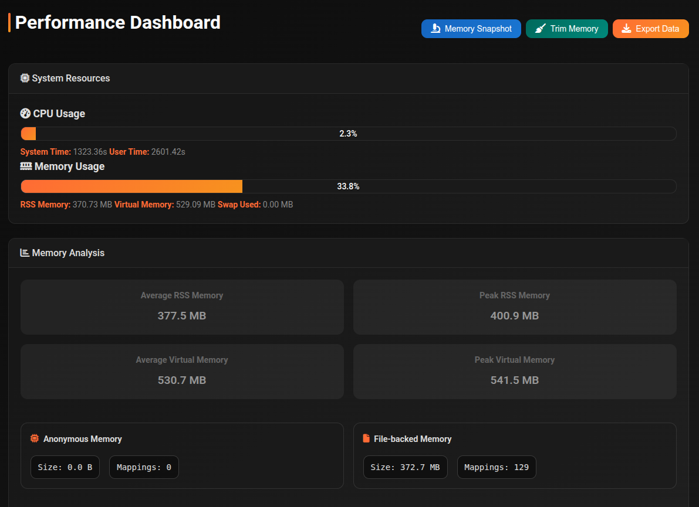

# Performance Dashboard

The Performance Dashboard gives you real-time visibility into cli_debrid's CPU and memory usage. Useful for diagnosing slowdowns, memory leaks, or high resource consumption.

Access it by clicking the **Uptime** card on the Dashboard, or from the navigation menu.

---

## Header actions

| Button | Description |
|---|---|
| **Memory Snapshot** | Capture a live memory snapshot — run this while memory is high to diagnose what's consuming RAM |
| **Trim Memory** | Run `gc.collect()` + `malloc_trim(0)` to release glibc arena pages back to the OS. Shows before→after MB and freed MB after completing. |
| **Export Data** | Download the full performance data as a JSON file — useful for sharing with support or offline analysis |

---

## System Resources

Live CPU and memory progress bars showing current usage percentage.

| Metric | Description |
|---|---|
| **CPU Usage** | Current CPU usage % with user time and system time breakdown |
| **Memory Usage** | System memory usage % with RSS, Virtual Memory, and Swap Used details |

---

## Memory Analysis

Summary statistics calculated from the last hour of readings:

| Metric | Description |
|---|---|
| **Average RSS Memory** | Mean resident set size over the period |
| **Peak RSS Memory** | Highest RSS reading in the period |
| **Average Virtual Memory** | Mean virtual address space over the period |
| **Peak Virtual Memory** | Highest VMS reading in the period |
| **Anonymous Memory** | Memory not backed by a file — size and mapping count |
| **File-backed Memory** | Memory mapped from files — size and mapping count |
| **Open Files** | List of currently open file handles with path and size |

---

## Memory Growth

A line chart showing RSS and VMS over the last hour. Also shows a snapshot table with readings at 10-minute intervals displaying RSS, VMS, and Swap at each point.

A steadily climbing RSS line indicates a potential memory leak.

| Series | Description |
|---|---|
| **RSS Memory** | Resident Set Size — actual RAM in use |
| **Virtual Memory** | Total virtual address space allocated |

---

## Resource Handles

| Metric | Description |
|---|---|
| **Open Files** | Total count of open file handles |
| **File Types** | Distinct file extensions currently open |

---

## CPU Profile

Historical CPU usage chart for the last hour plus a detailed summary:

| Metric | Description |
|---|---|
| **Average CPU** | Mean CPU usage % over the period |
| **Peak CPU** | Highest CPU spike in the period |
| **CPU Time** | Cumulative user and system time since process start |
| **Active Threads** | Number of running threads with per-thread user/system time and a visual bar |

---

## Memory Snapshot

Click **Memory Snapshot** to capture a detailed live snapshot. The result panel shows:

| Field | Description |
|---|---|
| **RSS Memory** | Current resident set size |
| **Virtual Memory** | Current virtual memory size |
| **Active Threads** | Thread count at snapshot time |
| **Session Store** | Number of active sessions |
| **Task Queue** | Queued and completed task counts |
| **Function Cache** | Number of cached function entries |
| **Scan Progress Keys** | Active scan progress trackers |
| **Analysis Progress Keys** | Active analysis progress trackers |
| **Notification Queues** | Number of notification queues |
| **Top Python Object Types** | Table of the most numerous Python object types by count — useful for identifying memory leaks |
| **Thread Names** | Expandable list of all active thread names |

Click **Download** in the snapshot panel to save it as a JSON file.

---

## Auto-refresh

The dashboard refreshes automatically every 60 seconds.

---

## Healthy baselines

For reference, typical memory usage:

| State | Expected RSS |
|---|---|
| Cold start (no activity) | ~280–300 MB |
| Warm idle (after running) | ~350–400 MB |
| Active scraping | ~400–500 MB |
