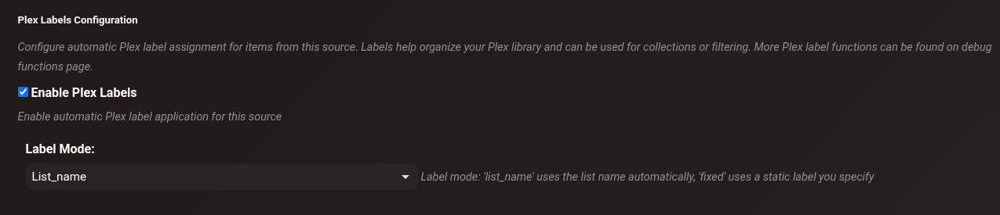
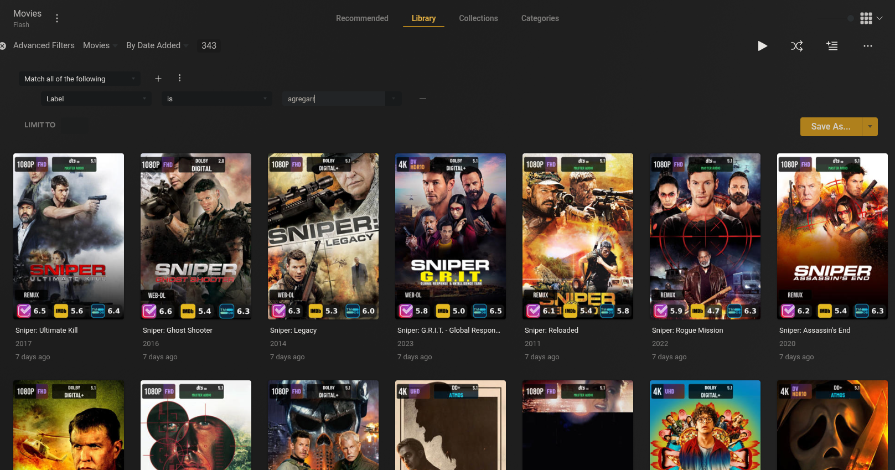

# Plex Label Manager

The Plex Label Manager automatically labels your Plex items based on which content source added them, or who requested them via Seerr. This lets you create Plex smart collections and see at a glance where content came from.



---

## What are Plex labels?

Plex labels are tags applied to movies and TV shows in your Plex library. cli_debrid manages these automatically based on your content source configuration. Use them to:

- **Track requesters** — see who requested each item (e.g. `Requested by John`)
- **Identify sources** — know which source added an item (e.g. `Overseerr`, `Trakt: Family Movies`)
- **Create smart collections** — use Plex's smart filter feature to build persistent filtered views
- **Monitor usage** — track which users are actively requesting content

---

## Label modes

Configure the label mode per content source in **Settings → Content Sources → [Source] → Plex Labels**:

| Mode | Label applied | Example |
|---|---|---|
| **List Name** | The content source's display name | `Trakt Watchlist`, `MDBList Sci-Fi` |
| **Fixed** | A custom label you define | `Auto-Downloaded` |
| **Requester** | Seerr requester's username | `john`, `alice` |

---

## How labels are applied

Labels are applied in two ways:

- **During collection** — when an item is successfully collected, labels are generated and synced to Plex immediately
- **Manual sync** — use the utilities in Debug Functions to sync labels for existing items

---

## Utilities (Debug Functions)

Access all label management tools from **Debug Functions → Plex Label Management**.

### View Items by Label

Search for all items in your library that have a specific label applied. Useful for auditing label application and verifying which items are tagged.

### Bulk Apply Labels from Source

Retroactively apply labels from a specific content source to all matching collected items. Use this after enabling Plex labels for a source that already had collected items.

**How:** Select a source from the dropdown → **Preview** to see what will be labelled → **Apply Labels**

### Bulk Remove Labels

Remove a specific label from all items in the database and Plex. Use when disabling a source, renaming a label, or cleaning up old labels.

**How:** Enter the label name → **Preview** → **Remove Label**

### Orphaned Label Cleanup

Finds and removes labels that are tracked in the database but whose content source no longer exists or has been disabled. Keeps your Plex label list clean.

**How:** **Find Orphaned Labels** → **Cleanup**

### Sync Labels from Content Sources

Re-syncs all labels based on current content source configurations. Applies labels to all Collected items from sources that have Plex labels enabled.

---

## Sync functions (Debug Functions → Run Task Manually)

| Function | Processes | Updates DB? | Syncs to Plex? | Time | Use case |
|---|---|---|---|---|---|
| **Sync Plex Labels** | Collected items due for sync | ✅ Labels | ✅ | Minutes | Automatic periodic sync (every 30 min) |
| **Backfill Plex Labels Content Source Detail** | Items with NULL/Unknown requester | ✅ Requester names only | ❌ | Minutes | Fix missing requester names |
| **Sync Labels from Content Sources (Full - All Items)** | ALL items (5000+) | ✅ Labels | ✅ | 13–14 hours | Initial setup, after config changes |
| **Sync Labels from Content Sources (Incremental - Last 7 Days)** | Changed/new items (~5–30) | ✅ Labels | ✅ | 5–15 minutes | Routine maintenance |
| **Backfill Missing Labels** | Items with NULL/empty labels | ✅ Labels | ✅ | Varies | Catch-up, error recovery |

### Sync Plex Labels

!!! info "Scheduled task"
    Runs automatically every **30 minutes** by default. Adjust the interval or trigger manually in the [Task Manager](task-manager.md) under the **Features** tab.

The automatic periodic task that runs in the background. Syncs labels for Collected items that are due for a sync. You can also trigger it manually to force an immediate sync without waiting for the next scheduled run.

### Backfill Plex Labels Content Source Detail

Queries the Overseerr API to retrieve actual requester names for items showing "Unknown" and updates the database. Does **not** sync labels to Plex — only updates the database.

Use when: upgrading from an older version that didn't track requester names, or after restoring from a backup with incomplete data.

### Sync Labels from Content Sources (Full - All Items)

Processes all collected items, regenerates labels from current content source data, and syncs all labels to Plex. Sets timestamp tracking for future incremental syncs.

!!! warning "Full sync is slow"
    Processing 5000+ items at 2–3 items/second takes 13–14 hours. Schedule overnight. Progress is logged every 20 items — monitor in the Logs page. Safe to restart if interrupted — won't duplicate labels.

### Sync Labels from Content Sources (Incremental - Last 7 Days)

Only processes items that have never been synced (`plex_labels_last_synced = NULL`) or were collected in the last 7 days. Typically completes in 5–15 minutes — **recommended for routine maintenance**.

### Backfill Missing Labels

Finds items with a NULL or empty labels field, generates labels from their content source data, and syncs to Plex. Non-destructive — preserves existing labels on other items. Safe to run multiple times.

---

## Recommended workflows

### Initial setup

1. Configure label settings in **Settings → Content Sources**
2. Run **Backfill Content Source Detail** (5–15 min) — fills in requester names
3. Run **Full Sync** (13–14 hours — run overnight)
4. Verify in Plex that labels appear correctly

### Routine maintenance

- **Daily or weekly:** Run **Incremental Sync** (5–15 minutes)
- **As needed:** Run **Backfill Missing Labels** if any items are missing labels

### After configuration changes

1. Optionally run **Backfill Content Source Detail** if requester data may have changed
2. Run **Full Sync** to ensure all items reflect the new configuration

---

## Using labels in Plex

Once labels are applied you can filter by them in Plex:

1. In your library, click **All** → **Filters**
2. Select **Label** → choose your label
3. Save as a **Smart Collection** for a persistent filtered view

Examples:
- *"Requested by Alice"*
- *"From Trakt Watchlist"*
- *"From MDBList Horror"*



---

## Troubleshooting

**Labels not appearing in Plex**

1. Check **Settings → Content Sources** — verify labels are enabled for the source
2. Run **Backfill Content Source Detail**
3. Run **Full Sync**
4. Force a metadata refresh in Plex

**Labels show "Unknown" instead of names**

1. Run **Backfill Content Source Detail** — fetches actual names from Overseerr
2. Run **Full Sync** — applies updated names to Plex

**Some items have labels, others don't**

- Run **Backfill Missing Labels** — catches items with NULL labels
- Check logs for errors about specific titles
- Verify the items exist in Plex

**Full sync taking too long**

- This is expected — 5000+ items at 2–3 items/second = 13–14 hours
- Let it run overnight and monitor progress in the Logs page
- Use Incremental Sync for all future routine maintenance

---

## Technical notes

- **TV shows:** Labels are applied at the show level, not per episode. Processing 100 episodes of a show makes only **1 API call** to Plex.
- **Rate limiting:** Processes ~2–3 items/second to avoid overwhelming the Plex API.
- **Database fields:** `content_source`, `content_source_detail`, `plex_labels` (JSON), `plex_labels_last_synced` (timestamp for incremental mode).

### Custom sync interval (API)

To sync items from a custom window instead of the default 7 days:

```bash
# Sync items from last 30 days
curl -X POST http://localhost:5000/debug/sync_plex_labels \
  -H "Content-Type: application/json" \
  -d '{"incremental": true, "days_back": 30}'
```
