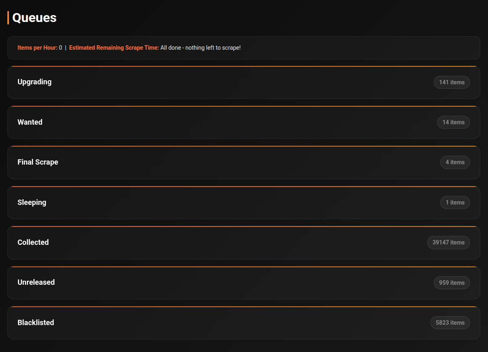

# Queues

The Queues page shows the real-time status of every item being processed by cli_debrid. Each item moves through a series of states from discovery to collection.



---

## How it works

cli_debrid runs a continuous loop. On each cycle it:

1. Checks all enabled **Content Sources** for new items and adds them to **Wanted**
2. **Scrapes** all configured scrapers simultaneously to find torrents for Wanted items
3. Scores results against your **Version** settings — resolution, filters, codec preferences — and submits the best match to your debrid provider
4. **Checks** whether the file is available at your mount path
5. Marks items as **Collected**, notifies your media server, and applies labels/overlays

---

## Processing pipeline

```
Wanted → Scraping → Adding → Checking → Collected
                                 ↓
                          Blacklisted / Sleeping
```

---

## Queue states

### Wanted
Items that need to be scraped — waiting for their turn in the scraping loop. Items also land here if their release date hasn't arrived yet.

### Scraping
cli_debrid is actively searching your configured scrapers for a matching torrent.

### Adding
A torrent has been found and is being submitted to your debrid provider.

### Checking
The item has been added to debrid. cli_debrid is monitoring it:

| Sub-state | Description |
|---|---|
| **Cached** | Already in debrid cache — checking for local file presence |
| **Downloading** | Being downloaded to the debrid server — shows progress % |

Once the file appears at the mount path, the item is marked **Collected**, your media server is notified, and labels/overlays are applied if configured.

### Unreleased
The item has a known future release date. cli_debrid will automatically move it to Wanted after release.

### Sleeping
All available torrents for this item have been tried and blacklisted. The item will automatically retry when the blacklist duration expires.

### Pending Uncached
Found a torrent but it's not cached on the debrid service. Waiting for an uncached download slot.

### Final Scrape
A last-attempt scrape for items that have been trying for a while.

### Blacklisted
Explicitly ignored — either manually or after repeated failures. Won't be retried unless manually cleared.

---

## Reading the queue

Each queue section is collapsible. The item count is shown in the header.

Click the **▶** arrow next to any item to expand its details:

- Torrent title
- File path
- Hash
- Scraper source
- Time in current state

---

## Checking queue — progress display

Items in the **Checking** state show live download progress when being downloaded from debrid.

Toggle the **Show Filename** button to switch between showing the torrent title and the matched file path.

---

## Processing intervals

cli_debrid processes each queue on its own schedule. These are the default intervals:

### Queue intervals

| Queue | Default interval | Description |
|---|---|---|
| Wanted | 60s | Moves items to Scraping or Unreleased |
| Scraping | 1s | Searches scrapers, moves to Adding or Sleeping |
| Adding | 1s | Submits to debrid provider, moves to Checking or Sleeping |
| Checking | 30s | Monitors file availability at mount path |
| Sleeping | 5 min | Retries items that haven't been found yet |
| Unreleased | 5 min | Checks if release date has passed |
| Upgrading | 1 hr | Scrapes for quality upgrades for recently collected items |
| Blacklisted | 2 hrs | Periodically reviews blacklisted items |
| Pending Uncached | 1 hr | Waits for uncached debrid downloads |
| Final Check | 15 min | Last-attempt scrape for long-waiting items |
| Pre-release | 24 hrs | Handles pre-release content |

!!! tip
    All intervals can be customised from the **Task Manager** page.

---

## Upgrading queue

Items enter the Upgrading queue when they are successfully collected and were released recently. cli_debrid scrapes for better quality versions every **hour**.

By default, items remain in the Upgrading queue for **24 hours** after collection before being considered fully settled. This duration is configurable in **Advanced Settings → Upgrade Queue Duration**.

---

## Sleep and wake mechanism

Items that can't be found go to **Sleeping**. Each time an item wakes and is retried without success, its **wake count** increments.

| Setting | Default |
|---|---|
| Sleep duration | 30 min |
| Wake limit | 24 attempts |

When the wake limit is reached, the item moves to **Blacklisted**. Items with a release date older than one week are also blacklisted immediately.

The wake limit is configurable per Version (set to `-1` to skip sleeping and blacklist immediately) and globally in **Settings → Queue → Wake Limit**.

---

## Blacklisting

Items are blacklisted when:

- They exceed the wake limit
- Their release date is more than one week old and were never found

Blacklisted items are not retried unless you manually clear them (Library page) or have **Blacklist Duration** enabled in settings, which automatically unblacklists items after a set period.

---

## Multi-pack processing

When a multi-pack result (e.g. a full season pack) is found and added:

- The original item moves to Checking
- All matching episodes currently in Wanted, Scraping, or Sleeping are also moved to Checking
- All affected items are added to the Upgrading queue for potential future upgrades

---

## Troubleshooting

**Item stuck in Wanted**

cli_debrid is searching but finding nothing:

- No scrapers configured or reachable — check the Connections page
- Content doesn't exist on your scrapers yet (new release, obscure title)
- Version settings are too strict — try loosening filters

**Item stuck in Checking**

The file was added to debrid but isn't appearing at the mount path:

- Your Zurg/rclone or Decypharr mount isn't working — check you can browse the mount path
- The file is still downloading (uncached) — wait for it to complete
- Wrong mount path in **Required Settings → Original Files Path**

**Item moves to Sleeping**

All known torrents have been tried and blacklisted. cli_debrid will retry when the blacklist expires. To retry immediately, clear the blacklist from the Library page.

**Processing cycle timing**

The main loop runs every **60 seconds** by default (configurable in Scraping settings). For large libraries with many Wanted items, a single cycle may take several minutes.
