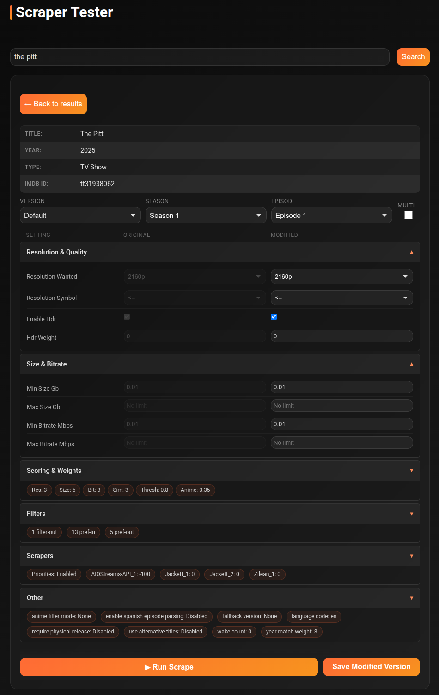
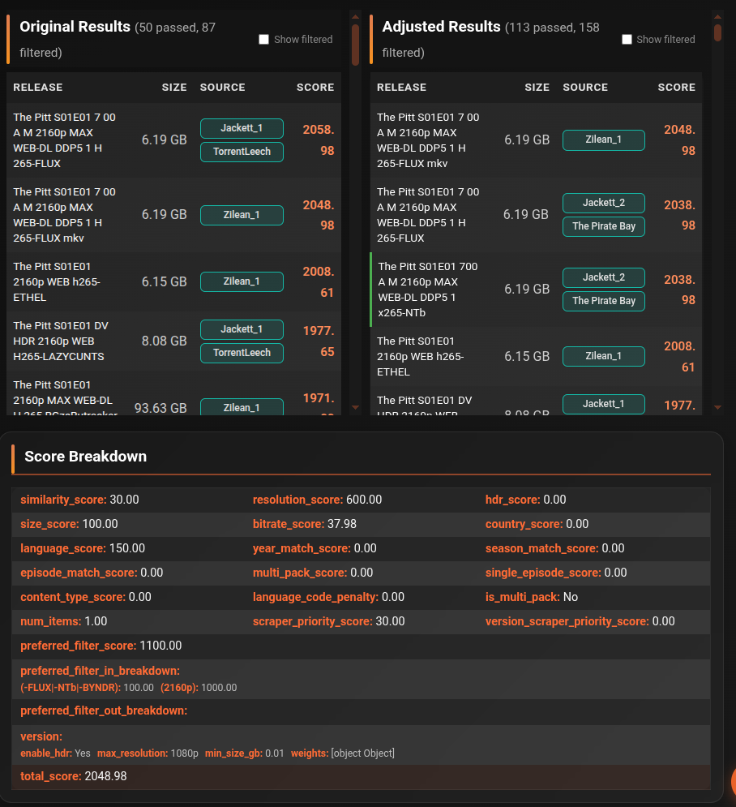

# Scraper Tester

The Scraper Tester lets you test and compare how your version settings affect torrent scraping results — without changing anything permanently. Run a scrape with your current settings and a modified version side-by-side to see exactly how tweaks change what gets selected.

!!! note "Desktop only"
    The Scraper Tester requires a desktop browser — it is not available on mobile.

---

## Workflow

### Step 1 — Search for media

Type a movie or TV show title (e.g. `The Matrix`, `Breaking Bad`) and click **Search**. Select the item you want to test from the results list.

### Step 2 — Configure scrape details

| Control | Description |
|---|---|
| **Version** | Select which quality profile to test against |
| **Season** | (TV shows only) Select the season |
| **Episode** | (TV shows only) Select the episode |
| **Multi** | (TV shows only) Simulate a season pack / multi-episode search |

Two settings panels appear side by side:

- **Original Settings** — read-only display of your current saved version settings
- **Modified Settings** — editable version of the same settings for testing

Change any values in Modified Settings to see how they would affect results.

### Step 3 — Run the scrape

Click **Run Scrape**. cli_debrid runs two scrapes simultaneously — one with your original settings and one with the modified settings.

### Step 4 — Analyse results

Two result columns appear side by side:

| Column | Description |
|---|---|
| **Original Results** | Torrents ranked using your unchanged version settings |
| **Adjusted Results** | Torrents ranked using the modified settings |

Below the results, a **Score Breakdown** table shows the detailed scoring rules applied to the Adjusted Results — which rules passed or failed, and what score each contributed. This is the best way to understand why a specific torrent was selected or rejected.

### Step 5 — Save or start over

| Button | Description |
|---|---|
| **Save Modified Settings** | Persist the modified settings to your version profile permanently |
| **New Search** | Clear all results and start a new search |

!!! tip
    Use the Score Breakdown to understand torrent ranking logic before adjusting your version profiles. Small changes to weights and filters can have a big impact on which torrents get selected.
