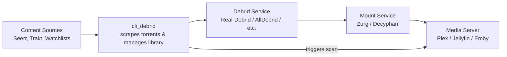

# Getting Started

This guide walks you through everything needed to get cli_debrid up and running from scratch — from signing up for the required services to streaming your first file.

Follow the steps in order. Each page ends with a link to the next step.

---

## The setup flow

<div class="grid cards single-col" markdown>

- **Step 1 — Prerequisites**

    Sign up for required services and gather your API keys before installing anything.

    [:octicons-arrow-right-24: Prerequisites](prerequisites.md){ .md-button .md-button--primary }

- **Step 2 — Mount your debrid storage**

    Use Zurg or Decypharr to mount your debrid cloud library as a local folder your media server can read.

    [:octicons-arrow-right-24: Mount setup](mount.md){ .md-button .md-button--primary }

- **Step 3 — Install cli_debrid**

    Install the app on your platform — Unraid, Docker, TrueNAS, Proxmox, Ubuntu, or Windows.

    [:octicons-arrow-right-24: Install](install.md){ .md-button .md-button--primary }

- **Step 4 — Configure cli_debrid**

    Connect your debrid provider, media server, and mount path. Choose Plex mode or symlink mode.

    [:octicons-arrow-right-24: Configure](configure.md){ .md-button .md-button--primary }

- **Step 5 — Add scrapers**

    Set up at least one scraper so cli_debrid can find torrents for your content.

    [:octicons-arrow-right-24: Scrapers](scrapers.md){ .md-button .md-button--primary }

- **Step 6 — Add content sources**

    Tell cli_debrid what to download — Trakt watchlists, Seerr requests, or manual lists.

    [:octicons-arrow-right-24: Content sources](content-sources.md){ .md-button .md-button--primary }

</div>

---

## How it all fits together



### File management modes

=== "Plex mode"

    ```mermaid
    flowchart LR
        A["Mount Service\nZurg / Decypharr"] --> B["Plex\nreads files directly from mount"]
        C["cli_debrid"] --> D["Debrid Service"]
        D --> A
        C -->|"triggers library scan via API"| B
    ```

    Plex reads files directly from the debrid mount. cli_debrid uses the Plex API to trigger scans. **Plex only.**

=== "Symlink mode"

    ```mermaid
    flowchart LR
        A["Mount Service\nZurg / Decypharr"] --> B["cli_debrid\ncreates symlinks"]
        B --> C["Symlink path\norganised folder structure"]
        C --> D["Media Server\nPlex / Jellyfin / Emby"]
        E["Debrid Service"] --> A
        B --> E
        B -->|"triggers scan"| D
    ```

    cli_debrid creates symlinks from the mount into an organised folder. Your media server scans the symlink folder. **Works with Plex, Jellyfin, and Emby.**

---

!!! tip "Already have some of this set up?"
    Jump straight to whichever step you need. Each page is self-contained.
