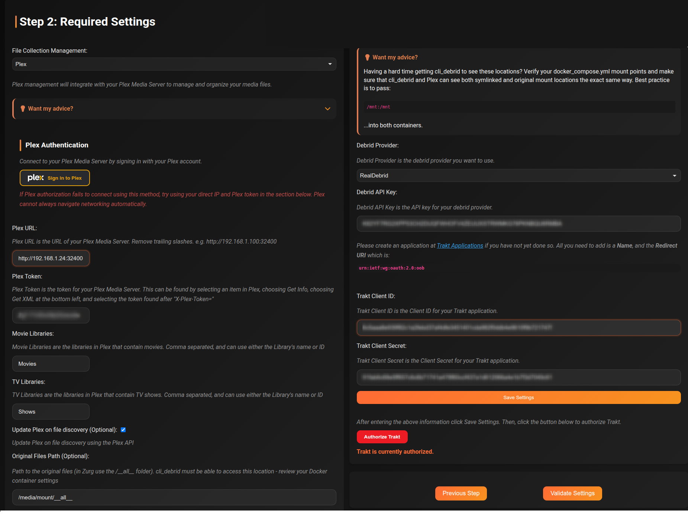

# Install with Docker

This guide covers installing cli_debrid using Docker and Docker Compose on Linux, macOS, or Windows. This is the recommended installation method.

!!! tip "Prefer a GUI?"
    If you use Portainer, Dockge, or Dockhand, the same Docker Compose file works — just paste it into your stack editor.

---

## Prerequisites

Before you begin, confirm you have:

- [Docker](https://docs.docker.com/get-docker/) installed and running
- [Docker Compose](https://docs.docker.com/compose/install/) v2 or later (`docker compose` command)
- A debrid account (Real-Debrid, AllDebrid, Premiumize, Torbox, or Debrid-Link)
- A [Trakt](https://trakt.tv) account
- Plex, Jellyfin, or Emby with your debrid library mounted (via [Zurg + rclone](../integrations/zurg.md) or [Decypharr](../integrations/decypharr.md))

!!! warning "Avoid Docker Desktop on Linux"
    On Linux servers, install Docker Engine directly — not Docker Desktop. Docker Desktop on Linux runs in a VM which can cause permission and mount issues with cli_debrid.

---

## Image tags

| Tag | Architecture | Branch | Notes |
|---|---|---|---|
| `godver3/cli_debrid:dev` | amd64 | dev | Latest features — recommended |
| `godver3/cli_debrid:dev-arm64` | arm64 | dev | For ARM devices (Raspberry Pi, Apple Silicon) |
| `godver3/cli_debrid:main` | amd64 | main | Stable, updated every 6–8 weeks |
| `godver3/cli_debrid:main-arm64` | arm64 | main | Stable ARM build |
| `godver3/cli_debrid:latest` | amd64 | dev | Pinned to newest dev build |

!!! note "Which tag should I use?"
    Use `:dev` for day-to-day use. Bugs are caught and fixed fastest on the dev branch. Use `:main` if you prefer less frequent updates.

---

## Step 1 — Create the directory

Create a directory to store cli_debrid's data:

```bash
mkdir -p ${HOME}/cli_debrid
cd ${HOME}/cli_debrid
```

---

## Step 2 — Create the Docker Compose file

Download the default compose file:

```bash
curl -O https://raw.githubusercontent.com/godver3/cli_debrid/main/docker-compose.yml
```

Or create it manually:

```bash
nano docker-compose.yml
```

!!! tip "Stack all services in one compose file"
    You can combine cli_debrid, Zurg/Decypharr, Plex, and Jellyfin into a single `docker-compose.yml` by adding each as a separate service under the same `services:` block. This makes it easier to start, stop, and update everything together with one `docker compose up -d` command. The same applies in Portainer, Dockge, and Dockhand — just paste the merged file into your stack editor.

Choose the compose file that matches your file management mode:

=== "Symlink mode"

    Use this when running Jellyfin, Emby, or Plex with symlinks.

    ```yaml title="docker-compose.yml"
    services:
      cli_debrid:
        image: godver3/cli_debrid:dev
        pull_policy: always
        container_name: cli_debrid
        ports:
          - "5000:5000"
          - "5001:5001"
        volumes:
          - /path/to/appdata/db_content:/user/db_content    # (1) e.g. /mnt/cache/appdata/cli_debrid/db_content
          - /path/to/appdata/config:/user/config             # (2) e.g. /mnt/cache/appdata/cli_debrid/config
          - /path/to/appdata/logs:/user/logs                 # (3) e.g. /mnt/cache/appdata/cli_debrid/logs
          - /path/to/your/debrid/mount:/media/mount          # (4) e.g. /mnt/cache/zurg, /mnt/data/debrid — must match media server
          - /path/to/your/symlinks:/mnt/symlinked            # (5) e.g. /mnt/disk1/TVShows — must match media server
          - /path/to/plex/Library/Application Support/Plex Media Server:/plex_data  # (6) optional — overlay feature, Plex only
        environment:
          - TZ=America/New_York                              # (7) your timezone
          - MALLOC_ARENA_MAX=2                               # (8) optional — limits glibc memory arenas, reduces memory fragmentation in Python apps
        restart: unless-stopped
        tty: true
        stdin_open: true
    ```

    1. SQLite databases — **back this up regularly**
    2. Settings and configuration files
    3. Application log files
    4. Your debrid mount (Zurg or Decypharr) — container path must match your media server exactly
    5. Where cli_debrid writes symlinks — container path must match your media server exactly
    6. **Optional** — only needed for the Overlay feature. Path to your Plex Media Server data folder
    7. Set to your local timezone — see [full list](https://en.wikipedia.org/wiki/List_of_tz_database_time_zones)
    8. **Optional** — limits memory arena allocation, reduces memory usage. Recommended for all installs

    !!! warning "Container paths must match your media server"
        The debrid mount and symlink folder must use **identical container paths** in both cli_debrid and your media server (Plex/Jellyfin/Emby). If they differ, symlinks will appear broken. See [Plex](../integrations/plex.md) and [Jellyfin](../integrations/jellyfin.md) guides for matching examples.

    !!! warning "Unraid users"
        Use the actual pool path for your volumes (e.g. `/mnt/cache/appdata/cli_debrid`), not the user share path (`/mnt/user/...`). This avoids array startup issues.

=== "Plex mode"

    Use this when running Plex with Plex mode (no symlinks). Plex reads directly from the debrid mount.

    **cli_debrid**

    ```yaml title="docker-compose.yml (cli_debrid)"
    services:
      cli_debrid:
        image: godver3/cli_debrid:dev
        pull_policy: always
        container_name: cli_debrid
        ports:
          - "5000:5000"
          - "5001:5001"
        volumes:
          - /path/to/appdata/db_content:/user/db_content    # (1) e.g. /mnt/cache/appdata/cli_debrid/db_content
          - /path/to/appdata/config:/user/config             # (2) e.g. /mnt/cache/appdata/cli_debrid/config
          - /path/to/appdata/logs:/user/logs                 # (3) e.g. /mnt/cache/appdata/cli_debrid/logs
          - /path/to/your/debrid/mount:/media/mount          # (4) e.g. /mnt/cache/zurg, /mnt/data/debrid
          - /path/to/plex/Library/Application Support/Plex Media Server:/plex_data  # (5) optional — overlay feature
        environment:
          - TZ=America/New_York                              # (6) your timezone
          - MALLOC_ARENA_MAX=2                               # (7) optional — limits glibc memory arenas, reduces memory fragmentation in Python apps
        restart: unless-stopped
        tty: true
        stdin_open: true
    ```

    1. SQLite databases — **back this up regularly**
    2. Settings and configuration files
    3. Application log files
    4. Your debrid mount (Zurg or Decypharr)
    5. **Optional** — only needed for the Overlay feature. Path to your Plex Media Server data folder
    6. Set to your local timezone — see [full list](https://en.wikipedia.org/wiki/List_of_tz_database_time_zones)
    7. **Optional** — limits memory arena allocation, reduces memory usage. Recommended for all installs

    ```yaml title="docker-compose.yml (Plex)"
    services:
      plex:
        image: lscr.io/linuxserver/plex:latest
        container_name: plex
        network_mode: host
        volumes:
          - /path/to/your/debrid/mount:/debrid:ro            # (1) e.g. /mnt/cache/zurg, /mnt/data/debrid
          - /path/to/plex/appdata:/config:rw                 # e.g. /mnt/cache/appdata/plex
          - /path/to/plex/transcode:/transcode:rw            # e.g. /mnt/cache/appdata/plex/transcode
          - /path/to/plex/data:/data:rw                      # e.g. /mnt/cache/appdata/plex/data
        environment:
          - TZ=America/New_York
          - VERSION=latest
          - PUID=0
          - PGID=0
          - UMASK=022
        restart: unless-stopped
        devices:
          - /dev/dri:/dev/dri                                # (2) optional — hardware transcoding
    ```

    1. Your debrid mount — in Plex mode the container path does not need to match cli_debrid
    2. **Optional** — only needed for hardware transcoding

    !!! warning "Unraid users"
        Use the actual pool path for your volumes (e.g. `/mnt/cache/appdata/cli_debrid`), not the user share path (`/mnt/user/...`). This avoids array startup issues.

---

## Step 3 — Start the container

```bash
docker compose up -d
```

Check that the container started successfully:

```bash
docker compose logs -f
```

You should see output like:

```
cli_debrid  | Starting cli_debrid...
cli_debrid  | Web interface available at http://0.0.0.0:5000
```

Press `Ctrl+C` to stop following the logs.

---

## Step 4 — Access the web interface

Open your browser and navigate to:

```
http://your-server-ip:5000
```

The first time you visit, the onboarding wizard will launch automatically.


---

## Step 5 — Complete onboarding

The onboarding wizard will guide you through:

1. **Account setup** — create your admin account
2. **Required settings** — connect your debrid provider, Trakt, and Plex/Jellyfin
3. **Scrapers** — configure at least one scraper (Zilean recommended to start)
4. **Content sources** — add your Trakt watchlists or other sources
5. **Library management** — choose Plex or Symlinked mode



!!! tip "Take your time with onboarding"
    You can always change settings later via the Settings page. The onboarding just gets you to a working state quickly.

---

## Ports

| Port | Purpose |
|---|---|
| `5000` | Main web UI and API |
| `5001` | HTTPS / alternate access |

---

## Common commands

### View logs
```bash
docker compose logs -f cli_debrid
```

### Restart the container
```bash
docker compose restart cli_debrid
```

### Stop cli_debrid
```bash
docker compose down
```

### Update to the latest image
```bash
docker compose pull && docker compose up -d
```

See the full [Updating](updating.md) guide for more detail.

---

## Next steps

- [Complete the onboarding wizard](../configuration/index.md)
- [Configure scrapers](../configuration/index.md)
- [Add content sources](../configuration/index.md)
