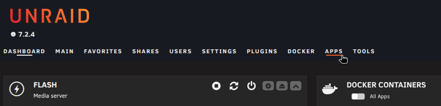
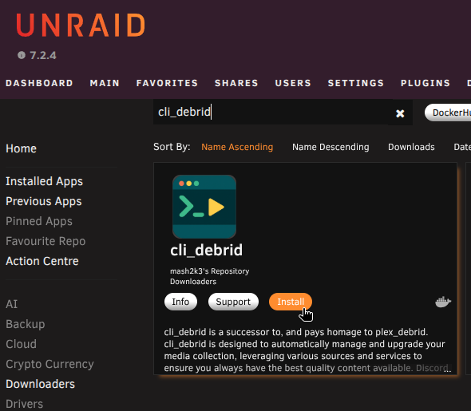
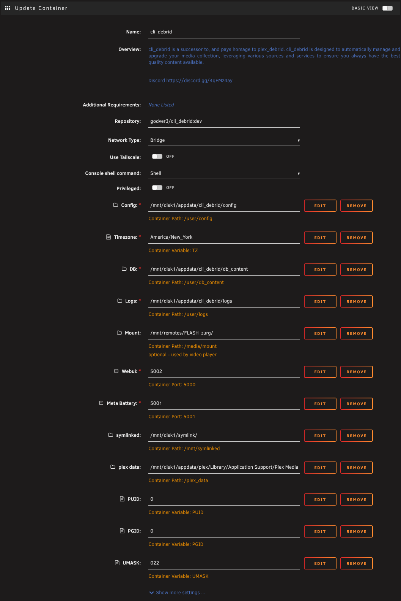
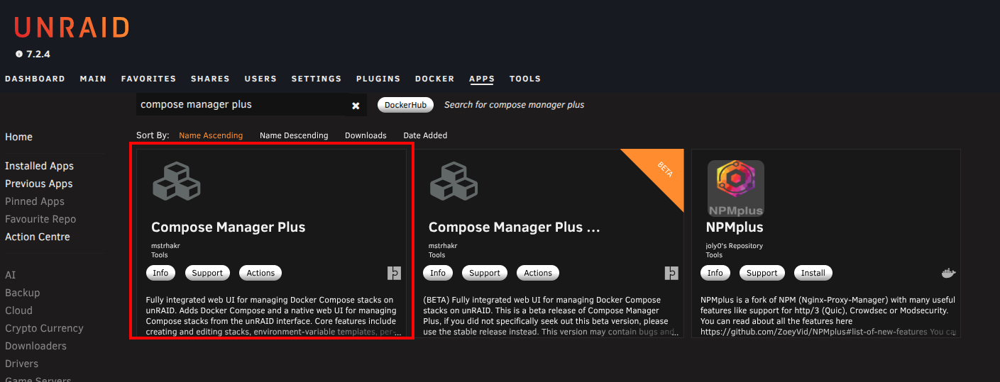
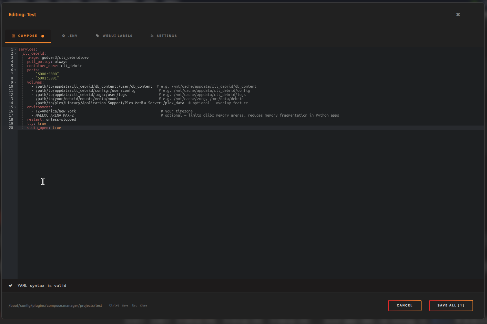
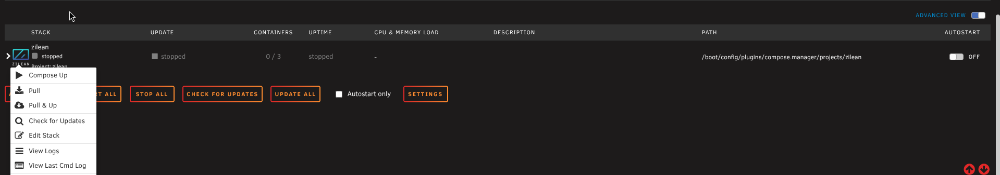

# Install on Unraid

Choose your preferred installation method below. All methods install the same CLI_Debrid docker — pick whichever you're most comfortable with.

After installing, continue to the integration guides:

- [Zurg + rclone](../integrations/zurg.md) or [Decypharr](../integrations/decypharr.md) — mount your debrid library
- [Plex](../integrations/plex.md) or [Jellyfin](../integrations/jellyfin.md) — add Debrid libraries
- [Seerr](../integrations/seerr.md) — content requests

---

## Prerequisites

Regardless of method, you need:

- Unraid 6.10 or later
- A paid debrid account (Real-Debrid, AllDebrid, Premiumize, Torbox, or Debrid-Link)
- A [Trakt](https://trakt.tv) account
- Plex or Jellyfin installed

---

## Installation methods

=== "Community Applications"

    The simplest method — installs with a pre-configured template.

    ### Step 1 — Open Community Applications

    In the Unraid web UI, click the **Apps** tab.

    

    ### Step 2 — Search for CLI_Debrid

    Type `CLI_Debrid` in the search bar and press Enter.

    

    ### Step 3 — Install the template

    Click **Install** on the template by **mash2k3**.

    ### Step 4 — Configure the template

    Fill in the template fields:

    | Field | Value |
    |---|---|
    | **Docker Image** | `godver3/cli_debrid:dev` |
    | **WebUI Port** | `5000` |
    | **DB Content Path** | `/mnt/cache/appdata/cli_debrid/db_content` → `/user/db_content` |
    | **Config Path** | `/mnt/cache/appdata/cli_debrid/config` → `/user/config` |
    | **Logs Path** | `/mnt/cache/appdata/cli_debrid/logs` → `/user/logs` |
    | **Media Mount** | Your debrid mount path (e.g. `/mnt/cache/zurg` for Zurg, `/mnt/data/debrid` for Decypharr) → `/mnt` |
    | **Timezone** | Your local timezone e.g. `America/New_York` |

    !!! warning "Use the :dev tag"
        Make sure the image is `godver3/cli_debrid:dev`. The `:latest` tag does not include all features or receive new feature updates.

    

    ### Step 5 — Apply

    Click **Apply**. Unraid pulls the image and starts the container.

=== "Compose Manager"

    Use this method if you prefer managing containers with Docker Compose files on Unraid.

    ### Step 1 — Install Compose Manager

    In Community Applications, search for and install the **Compose Manager Plus** plugin.

    

    ### Step 2 — Create a new compose project

    Go to **Settings → Docker Compose** and click **Add New Stack**.

    Name it `cli_debrid`.

    ### Step 3 — Paste the compose file

    Click the **Edit** icon on your new stack and paste:

    === "Plex mode"

        ```yaml title="docker-compose.yml"
        services:
          cli_debrid:
            image: godver3/cli_debrid:dev
            pull_policy: always
            container_name: cli_debrid
            ports:
              - "5000:5000"
              - "5001:5001"
            volumes:
              - /path/to/appdata/cli_debrid/db_content:/user/db_content  # e.g. /mnt/cache/appdata/cli_debrid/db_content
              - /path/to/appdata/cli_debrid/config:/user/config           # e.g. /mnt/cache/appdata/cli_debrid/config
              - /path/to/appdata/cli_debrid/logs:/user/logs               # e.g. /mnt/cache/appdata/cli_debrid/logs
              - /path/to/your/debrid/mount:/media/mount                   # e.g. /mnt/cache/zurg, /mnt/data/debrid
              - /path/to/plex/Library/Application Support/Plex Media Server:/plex_data  # optional — overlay feature
            environment:
              - TZ=America/New_York                                        # your timezone
              - MALLOC_ARENA_MAX=2                                         # optional — limits glibc memory arenas, reduces memory fragmentation in Python apps
            restart: unless-stopped
            tty: true
            stdin_open: true
        ```

    === "Symlink mode"

        ```yaml title="docker-compose.yml"
        services:
          cli_debrid:
            image: godver3/cli_debrid:dev
            pull_policy: always
            container_name: cli_debrid
            ports:
              - "5000:5000"
              - "5001:5001"
            volumes:
              - /path/to/appdata/cli_debrid/db_content:/user/db_content  # e.g. /mnt/cache/appdata/cli_debrid/db_content
              - /path/to/appdata/cli_debrid/config:/user/config           # e.g. /mnt/cache/appdata/cli_debrid/config
              - /path/to/appdata/cli_debrid/logs:/user/logs               # e.g. /mnt/cache/appdata/cli_debrid/logs
              - /path/to/your/debrid/mount:/media/mount                   # e.g. /mnt/cache/zurg, /mnt/data/debrid — must match media server
              - /path/to/your/symlinks:/mnt/symlinked                     # e.g. /mnt/disk1/TVShows — must match media server
              - /path/to/plex/Library/Application Support/Plex Media Server:/plex_data  # optional — overlay feature, Plex only
            environment:
              - TZ=America/New_York                                        # your timezone
              - MALLOC_ARENA_MAX=2                                         # optional — limits glibc memory arenas, reduces memory fragmentation in Python apps
            restart: unless-stopped
            tty: true
            stdin_open: true
        ```

    

    !!! warning "Unraid pool paths"
        Use the actual pool path (e.g. `/mnt/cache/appdata`), not `/mnt/user/...`. This avoids array startup issues.

    ### Step 4 — Start the stack

    Click **Compose Up** to pull the image and start the container.

    


---

## First launch

Once the container is running, open the web UI at:

```
http://YOUR_UNRAID_IP:5000
```

**Phalanx DB prompt:** On first launch you will see a prompt about Phalanx DB. Select **No — Disable** unless you specifically want this feature.

The onboarding wizard will then guide you through initial setup. See [Required Settings](../configuration/required.md) for what you'll need ready.

---

## Updating

See the [Updating guide](updating.md) for all update methods.

---

## Next steps

- Mount your debrid library: [Zurg + rclone](../integrations/zurg.md) or [Decypharr](../integrations/decypharr.md)
- Set up your media server: [Plex](../integrations/plex.md) or [Jellyfin](../integrations/jellyfin.md)
- [Set up Seerr](../integrations/seerr.md) — let users request content
