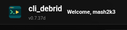

# Updating cli_debrid

cli_debrid uses Docker image tags — updating is just a matter of pulling the latest image and restarting the container. Your data is never affected by an update.

!!! note "Your data is safe"
    All databases, config, and logs are stored in your host-mounted volumes. Pulling a new image does not touch these.

---

## Docker Compose (recommended)

Run these two commands from the directory containing your `docker-compose.yml`:

```bash
docker compose pull
docker compose up -d
```

This pulls the latest image for your configured tag and recreates the container. The old image is kept locally until you prune it.

---

## Watchtower (automatic updates)

If you run [Watchtower](https://containrrr.dev/watchtower/), cli_debrid will be updated automatically whenever a new image is published.

To add Watchtower to your stack:

```yaml title="docker-compose.yml"
services:
  cli_debrid:
    image: godver3/cli_debrid:dev
    # ... your existing config ...

  watchtower:
    image: containrrr/watchtower
    volumes:
      - /var/run/docker.sock:/var/run/docker.sock
    environment:
      - WATCHTOWER_CLEANUP=true
      - WATCHTOWER_POLL_INTERVAL=3600   # Check every hour
    restart: unless-stopped
```

!!! warning "Watchtower restarts your container"
    Watchtower will stop and restart cli_debrid when an update is available. If you have active downloads in your queue, they will resume after restart but may experience a brief interruption.

### Tugtainer — GUI alternative to Watchtower

[Tugtainer](https://github.com/Quenary/tugtainer) is a web-based alternative to Watchtower with a visual interface for managing container updates. Easier to configure and gives you more control over when and what gets updated.

```yaml title="docker-compose.yml"
services:
  tugtainer:
    image: ghcr.io/quenary/tugtainer:latest
    container_name: tugtainer
    ports:
      - "8282:8282"
    volumes:
      - /var/run/docker.sock:/var/run/docker.sock
    restart: unless-stopped
```

Access the UI at `http://YOUR_SERVER_IP:8282` to select which containers to monitor and set your update schedule.

### Dockhand auto-updates

If you use Dockhand, auto-updates are built in — no extra tool needed.

**Per-container:** Edit any container → scroll to **Auto-update** → toggle **Enable automatic image updates** on.

**Per-environment:** Go to your environment → **Updates** tab → enable **Scheduled update check** to check all containers on a schedule. You can also enable **Automatic image pruning** to remove unused images automatically.

---

## Unraid

In the Unraid Docker tab, click the cli_debrid container row and select **Update**.

Alternatively, force-pull the latest image:

```bash
docker pull godver3/cli_debrid:dev
docker stop cli_debrid && docker start cli_debrid
```

### Automatic updates on Unraid

Install the **CA Auto Update Applications** plugin from Community Applications to automatically keep cli_debrid and other containers up to date.

1. Go to **Apps** and search for `CA Auto Update Applications`
2. Install the plugin by **Andrew Zawadzki**
3. Once installed, go to **Plugins → Auto Update Applications**
4. Select which containers to auto-update and configure your update schedule

---

## Windows

1. Download the latest `.exe` from the [Releases page](https://github.com/godver3/cli_debrid/releases)
2. Stop the running cli_debrid process
3. Replace the old `.exe` with the new one in your install directory
4. Start cli_debrid again

---

## Check current version

You can see the current version in the web UI footer, or by checking the container labels:

```bash
docker inspect cli_debrid | grep version
```

The version is also shown in the top bar of the cli_debrid web interface.



---

## Rollback

If an update causes issues, roll back to a previous image by pinning a specific version tag. Check available tags on [Docker Hub](https://hub.docker.com/r/godver3/cli_debrid/tags).

```yaml title="docker-compose.yml"
image: godver3/cli_debrid:dev-0.7.25  # example pinned version tag
```

Then run `docker compose up -d` to apply.
