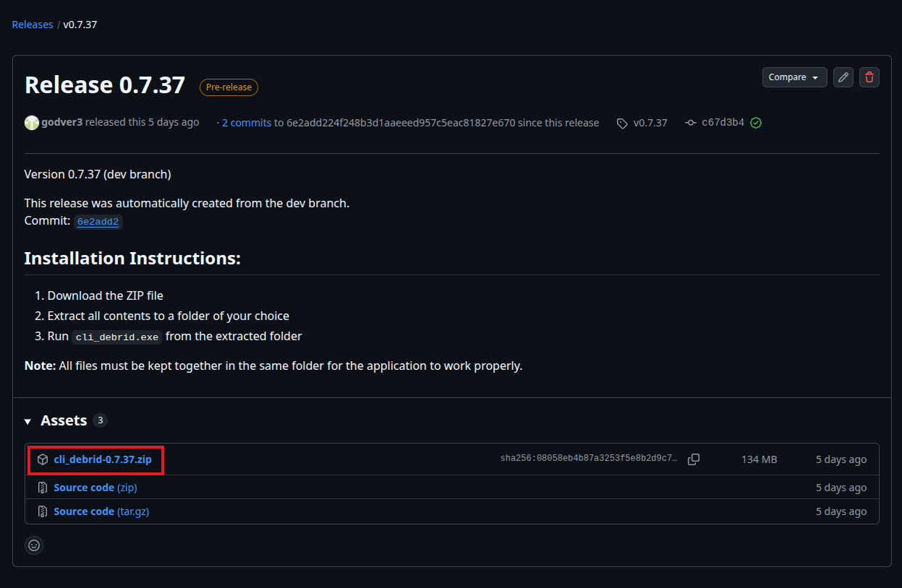

# Install on Windows

cli_debrid is available as a standalone Windows executable — no Docker, no Python installation required.

!!! warning "Symlinks on Windows"
    If you plan to use **Symlinked/Local** library management mode, Windows **Developer Mode** must be enabled first. Go to **Settings → System → For developers → Developer Mode → On**.

    Plex does **NOT** support symlinks on Windows. Use **Jellyfin** instead if you are on Windows with symlink mode.

---

## Prerequisites

- Windows 10 or Windows 11
- A debrid account (Real-Debrid, AllDebrid, Premiumize, Torbox, or Debrid-Link)
- A [Trakt](https://trakt.tv) account
- Plex or Jellyfin installed and running
- A debrid mount tool — [Zurg + rclone](../integrations/zurg.md) is the recommended option on Windows (see below)

---

## Step 1 — Download the executable

Go to the [Releases page](https://github.com/godver3/cli_debrid/releases) on GitHub and download the latest Windows build.



The file will be named something like `cli_debrid-windows-x64.exe` or packaged as a `.zip`.

---

## Step 2 — Extract and place the files

If downloaded as a `.zip`, extract it to a permanent location — for example:

```
C:\cli_debrid\
```

!!! warning "Do not run from Downloads"
    Do not run cli_debrid directly from your Downloads folder. Move it to a dedicated directory first, as it creates data folders relative to where it runs.

---

## Step 3 — Create data directories

cli_debrid will create its data folders automatically on first run, but you can create them in advance:

```
C:\cli_debrid\
  cli_debrid.exe
  db_content\
  config\
  logs\
```

---

## Step 4 — Run cli_debrid

Double-click `cli_debrid.exe` or run it from a terminal:

```powershell
cd C:\cli_debrid
.\cli_debrid.exe
```

A console window will open. You should see:

```
Starting cli_debrid...
Web interface available at http://0.0.0.0:5000
```

!!! tip "Run on startup"
    To start cli_debrid automatically with Windows, create a shortcut to the `.exe` in your Startup folder (`Win+R` → `shell:startup`). For a proper background service, consider using [NSSM](https://nssm.cc/) to wrap it as a Windows service.

---

## Step 5 — Access the web interface

Open your browser and go to:

```
http://localhost:5000
```

The onboarding wizard will launch on first visit.


---

## Updating on Windows

1. Download the latest `.exe` from the [Releases page](https://github.com/godver3/cli_debrid/releases)
2. Stop the running cli_debrid process
3. Replace the old `.exe` with the new one
4. Start cli_debrid again

Your data (`db_content\`, `config\`, `logs\`) is preserved between updates.

---

## Next steps

- [Complete the onboarding wizard](../configuration/index.md)
- [Configure scrapers](../configuration/index.md)
- [Add content sources](../configuration/index.md)

