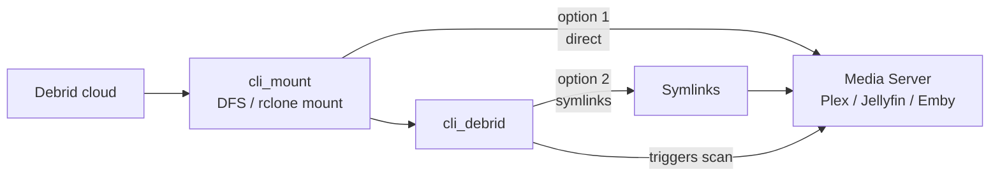

# cli_mount

cli_mount is an all-in-one debrid client that handles torrent management, mounting, and symlink delivery in a single container. It replaces the Zurg + rclone stack and integrates directly with cli_debrid via a blackhole/symlink workflow.

cli_mount is a fork of [Decypharr](https://github.com/sirrobot01/decypharr) maintained by mash2k3, optimised for cli_debrid compatibility.



!!! note "Nothing is stored locally"
    cli_mount streams content directly from Real-Debrid. No files are downloaded to your server.

---

## Prerequisites

- A paid debrid service account (e.g. Real-Debrid, AllDebrid, Torbox)
- Your debrid API token — found in your debrid provider's account settings
- `/dev/fuse` available on the host (required for mounting)

---

## Installation

=== "Docker Compose"

    ```yaml title="docker-compose.yml"
    services:
      cli_mount:
        image: ghcr.io/mash2k3/cli_mount:dev
        container_name: cli_mount
        restart: unless-stopped
        network_mode: bridge
        ports:
          - "8888:8888/tcp"
        volumes:
          - /path/to/debrid:/mnt:rw,shared     # (1)
          - /path/to/cache:/cache:rw # (2)
          - /path/to/appdata:/app:rw  # (3)
        devices:
          - /dev/fuse:/dev/fuse:rwm
        cap_add:
          - SYS_ADMIN
        security_opt:
          - apparmor:unconfined
        environment:
          - TZ=America/New_York
    ```

    1. Host path where your debrid library will be mounted — point Plex and cli_debrid here
    2. Cache directory for rclone VFS or DFS chunk cache
    3. Config file, database, and downloads folder

    !!! warning "Unraid users"
        Use the actual pool path for the mount volume (e.g. `/path/to/cache/cli_mount`), not the user share path. This avoids array startup issues.

    ```bash
    docker compose up -d
    docker compose logs -f
    ```

=== "Docker Run"

    ```bash
    docker create \
      --name='cli_mount' \
      --net='bridge' \
      --pids-limit 2048 \
      --privileged=true \
      -e TZ="America/New_York" \
      -p '8888:8888/tcp' \
      -v '/path/to/debrid':'/mnt':'rw,shared' \
      -v '/path/to/cache':'/cache':'rw' \
      -v '/path/to/appdata':'/app':'rw' \
      --device /dev/fuse:/dev/fuse:rwm \
      --cap-add SYS_ADMIN \
      --security-opt apparmor:unconfined \
      ghcr.io/mash2k3/cli_mount:dev

    docker start cli_mount
    docker logs -f cli_mount
    ```

    !!! warning "Unraid users"
        Use the actual pool path for the mount volume (e.g. `/path/to/cache/cli_mount`), not the user share path. This avoids array startup issues.

=== "Unraid"

    The simplest method — installs with a pre-configured template.

    **Step 1 — Open Community Applications**

    In the Unraid web UI, click the **Apps** tab.

    **Step 2 — Search for cli_mount**

    Type `cli_mount` in the search bar and press Enter.

    **Step 3 — Install the template**

    Click **Install** on the template by mash2k3.

    **Step 4 — Configure the template**

    Fill in the template fields:

    | Field | Value |
    |-------|-------|
    | Port | `8888` |
    | rclone | Your debrid mount path (e.g. `/path/to/debrid`) → `/mnt` |
    | cache | Your cache path (e.g. `/path/to/cache`) → `/cache` |
    | config | Your appdata path (e.g. `/path/to/appdata/cli_mount`) → `/app` |

    !!! warning "Use the :dev tag"
        The repository is `ghcr.io/mash2k3/cli_mount:dev` for the latest build. Check the [releases page](https://github.com/mash2k3/decypharr/releases) for stable tags.

    **Step 5 — Apply**

    Click **Apply**. Unraid pulls the image and starts the container.

    !!! warning "Unraid users"
        Use the actual pool path for the mount volume (e.g. `/path/to/cache/cli_mount`), not the user share path. This avoids array startup issues.

=== "Portainer / Dockge / Dockhand"

    Paste the same compose file from the Docker Compose tab into your stack editor and deploy.

    - **Portainer:** Stacks → Add Stack → paste → Deploy
    - **Dockge:** + Compose → paste → Deploy
    - **Dockhand:** Stacks → + Create → paste → Create & Start

=== "Binary (Linux)"

    The binary method runs cli_mount as a process directly on your Linux host — no Docker required.

    ### Step 1 — Create the appdata folder

    ```bash
    mkdir -p ~/cli_mount && cd ~/cli_mount
    ```

    ### Step 2 — Download cli_mount

    1. Go to [cli_mount releases](https://github.com/mash2k3/decypharr/releases) on GitHub
    2. Download the latest release for your platform:
        - Linux x64: `cli_mount_Linux_x86_64.tar.gz`
        - Linux ARM64: `cli_mount_Linux_arm64.tar.gz`
    3. Extract the archive:

    ```bash
    tar -xzf cli_mount_Linux_x86_64.tar.gz
    ```

    4. Place the extracted binary in your appdata folder and make it executable:

    ```bash
    chmod +x cli_mount
    ```

    ### Step 3 — Create config.json

    Create a `config.json` in your appdata folder. The web UI at `http://YOUR_SERVER_IP:8888` can also be used to generate this after first run — see [Configuration](#configuration) below.

    ### Step 4 — Start cli_mount

    Run the binary, pointing it at your config file:

    ```bash
    ./cli_mount --config /path/to/cli_mount/
    ```

    To run it as a background service, create a systemd unit:

    ```ini title="/etc/systemd/system/cli_mount.service"
    [Unit]
    Description=cli_mount debrid client
    After=network.target

    [Service]
    WorkingDirectory=/home/YOUR_USER/cli_mount
    ExecStart=/home/YOUR_USER/cli_mount/cli_mount --config /home/YOUR_USER/cli_mount/
    Restart=always

    [Install]
    WantedBy=multi-user.target
    ```

    ```bash
    systemctl enable cli_mount
    systemctl start cli_mount
    ```

    ### Step 5 — Verify

    Open the cli_mount web UI to confirm it is running and connected:

    ```
    http://YOUR_SERVER_IP:8888
    ```

=== "Binary (Unraid)"

    Run cli_mount as a binary on Unraid using User Scripts — useful if you prefer to avoid Docker or want tighter control over the process.

    ### Step 1 — Create the appdata folder

    ```
    /path/to/appdata/cli_mount/
    ```

    ### Step 2 — Download cli_mount

    1. Go to [cli_mount releases](https://github.com/mash2k3/decypharr/releases) on GitHub
    2. Download the latest `cli_mount_Linux_x86_64.tar.gz`
    3. Extract the archive and place the `cli_mount` binary in your appdata folder:

    ```bash
    tar -xzf cli_mount_Linux_x86_64.tar.gz
    cp cli_mount /path/to/appdata/cli_mount/
    chmod +x /path/to/appdata/cli_mount/cli_mount
    ```

    ### Step 3 — Create config.json

    Create a `config.json` in `/path/to/appdata/cli_mount/`. The web UI at `http://YOUR_SERVER_IP:8888` can also be used to generate and edit settings after first run — see [Configuration](#configuration) below.

    ### Step 4 — Create User Scripts

    Go to **Settings → User Scripts** and create the following scripts:

    **Script 1 — Start cli_mount** (Schedule: At Startup of Array)

    ```bash
    #!/bin/bash
    chmod +x /path/to/appdata/cli_mount/cli_mount
    /path/to/appdata/cli_mount/cli_mount --config /path/to/appdata/cli_mount/ &
    ```

    !!! warning "Always use Run in Background"
        When running manually from User Scripts, always click **RUN IN BACKGROUND**.

    **Script 2 — Stop cli_mount** (Schedule: At Stopping of Array)

    ```bash
    #!/bin/bash
    pkill cli_mount
    ```

    !!! danger "This script is important"
        Without a stop script, stopping the array while cli_mount holds a FUSE mount can cause an unclean shutdown and trigger a parity check.

    ### Step 5 — Verify

    Open the cli_mount web UI to confirm it is running:

    ```
    http://YOUR_SERVER_IP:8888
    ```

=== "Windows"

    cli_mount has a native Windows binary — no Docker required.

    ### Step 1 — Download cli_mount

    1. Go to [cli_mount releases](https://github.com/mash2k3/decypharr/releases) on GitHub
    2. Download the latest `cli_mount_Windows_x86_64.zip`
    3. Extract the zip and place `cli_mount.exe` in a permanent folder (e.g. `C:\cli_mount\`)

    ### Step 2 — Create config.json

    Create a `config.json` in the same folder. The web UI at `http://localhost:8888` can also be used to generate and edit settings after first run — see [Configuration](#configuration) below.

    ### Step 3 — Run cli_mount

    Open a terminal in the folder and run:

    ```powershell
    .\cli_mount.exe --config C:\cli_mount\
    ```

    ### Step 4 — Run at startup (optional)

    To start cli_mount automatically when Windows boots:

    1. Press `Win + R`, type `shell:startup`, press Enter
    2. Create a shortcut to `cli_mount.exe` in the folder that opens, with `--config C:\cli_mount\` as the argument

    Alternatively, use **Task Scheduler** to create a task that runs `cli_mount.exe` at logon with the config argument.

    ### Step 5 — Verify

    Open the cli_mount web UI to confirm it is running:

    ```
    http://localhost:8888
    ```

---

## Configuration

cli_mount is configured via a `config.json` file placed in your appdata folder (`/app` inside the container). The web UI at `http://YOUR_SERVER_IP:8888` can also be used to edit settings after first run.

### Debrid provider

Add your Real-Debrid API key and tune the connection settings:

| Setting | Value | Description |
|---|---|---|
| `provider` | `realdebrid` | Debrid provider name |
| `api_key` | `YOUR_API_KEY` | Your Real-Debrid API token |
| `rate_limit` | `250/minute` | Matches Real-Debrid's default API limit |
| `minimum_free_slot` | `1` | Minimum available download slots before queueing |
| `torrents_refresh_interval` | `15s` | How often to poll Real-Debrid for torrent changes |
| `download_links_refresh_interval` | `40m` | How often to refresh expiring download links |
| `workers` | `600` | Concurrent link-generation workers — suitable for large libraries |
| `auto_expire_links_after` | `3d` | How long to cache links before forcing a refresh |

### Mount mode

cli_mount supports two mount backends. Choose one:

=== "DFS (recommended)"

    DFS is cli_mount's native mount system — lighter than rclone with no separate binary required.

    | Setting | Value | Description |
    |---|---|---|
    | `type` | `dfs` | Selects the DFS mount backend |
    | `mount_path` | `/mnt` | Where the library is mounted inside the container |
    | `cache_expiry` | `24h` | How long file metadata is cached |
    | `cache_dir` | `/cache/dfs` | Where DFS stores its chunk cache |
    | `disk_cache_size` | `500MB` | Max cache size on disk |
    | `chunk_size` | `8MB` | Read chunk size — increase if experiencing stuttering |
    | `read_ahead_size` | `128MB` | How much to buffer ahead during playback |
    | `uid` / `gid` | `1000` / `1000` | File ownership for the mount |
    | `allow_other` | `true` | Required so Plex can access the mount |

=== "rclone"

    rclone mode uses an embedded rclone binary with a full VFS cache. More compatible but heavier on disk I/O.

    | Setting | Value | Description |
    |---|---|---|
    | `type` | `rclone` | Selects the rclone mount backend |
    | `mount_path` | `/mnt` | Where the library is mounted inside the container |
    | `port` | `5572` | rclone RC API port |
    | `cache_dir` | `/cache` | VFS cache location |
    | `vfs_cache_mode` | `full` | Full VFS cache for best compatibility |
    | `vfs_cache_max_age` | `5h` | How long cached chunks are kept |
    | `vfs_cache_max_size` | `12G` | Maximum VFS cache size on disk |
    | `vfs_read_chunk_size` | `128M` | Initial read chunk size |
    | `transfers` | `6` | Parallel download streams |
    | `uid` / `gid` | `1000` / `1000` | File ownership for the mount |
    | `no_checksum` | `true` | Skips checksum verification for faster streaming |

=== "External rclone"

    Use this when managing the rclone mount yourself outside of cli_mount — for example via Unraid User Scripts. cli_mount exposes its library as a WebDAV source (`cli_mount:`) which rclone mounts to a local path.

    !!! note "Prerequisite"
        The **rclone** Unraid plugin must be installed to have the `rclone` and `fusermount` commands available. Install it from the **Apps** tab in the Unraid web UI.

    #### Mount script (At Startup of Array)

    ```bash
    #!/bin/bash
    sleep 10    # (1)
    rclone mount cli_mount: /path/to/debrid \
      --dir-cache-time 20s \
      --config=/path/to/appdata/cli_mount/rclone/rclone.conf \
      --allow-other \
      --allow-non-empty \
      --gid 100 \
      --uid 1000 \
      --vfs-cache-mode full \
      --vfs-cache-max-age 5h \
      --vfs-cache-max-size 12G \
      --cache-dir /path/to/cache/cli_mount \
      --retries 0 \
      --low-level-retries 0 \
      --daemon
    ```

    1. Give cli_mount time to start up before rclone tries to connect

    !!! warning "Always use Run in Background"
        When running this script manually from User Scripts, always click **RUN IN BACKGROUND**.

    #### Unmount script (At Stopping of Array)

    ```bash
    #!/bin/bash
    fusermount -uz /path/to/debrid
    ```

    !!! danger "This script is critical"
        Without it, stopping the array while the FUSE mount is active causes a "Retry un-mounting disks" error and forces an unclean shutdown and parity check.

    Adjust `/path/to/debrid`, the `rclone.conf` path, and `--cache-dir` to match your actual paths.

    !!! tip "Combining with the cli_mount binary scripts"
        If you are also running cli_mount as a binary (see the **Binary (Unraid)** tab), you can combine these into the same User Scripts rather than maintaining separate ones. Start cli_mount first, add a `sleep` to give it time to initialise, then run the rclone mount. On shutdown, unmount rclone first, then stop cli_mount.

        **Combined startup script:**
        ```bash
        #!/bin/bash
        # Start cli_mount
        chmod +x /path/to/appdata/cli_mount/cli_mount
        /path/to/appdata/cli_mount/cli_mount --config /path/to/appdata/cli_mount/ &
        # Wait for cli_mount to initialise before mounting
        sleep 15
        # Mount with rclone
        rclone mount cli_mount: /path/to/debrid \
          --dir-cache-time 20s \
          --config=/path/to/appdata/cli_mount/rclone/rclone.conf \
          --allow-other \
          --allow-non-empty \
          --gid 100 \
          --uid 1000 \
          --vfs-cache-mode full \
          --vfs-cache-max-age 5h \
          --vfs-cache-max-size 12G \
          --cache-dir /path/to/cache/cli_mount \
          --retries 0 \
          --low-level-retries 0 \
          --daemon
        ```

        **Combined stop script:**
        ```bash
        #!/bin/bash
        # Unmount rclone first, then stop cli_mount
        fusermount -uz /path/to/debrid
        sleep 5
        pkill cli_mount
        ```

### Content routing

cli_mount sorts incoming torrents into subfolders using `custom_folders`. Each folder has regex filters that match against the torrent name and file list:

#### shows

| Filter | Pattern |
|---|---|
| `regex` | `(?i)(S[0-9]{2,3}|SEASONS?(?:[0-9]{1,2})(?:[.\s_\-E]|$)|Sezon[.\s]?\d+|Season[.\s]?(?:[0-9]{1,2})(?:[.\s_\-E(]|$)|\(Season\s+[0-9]+\)|Seasons\s+[0-9]|Complete.Series|[^457a-z\W\s]-[0-9]+|(19|20)([0-9]{2}\.[0-9]{2}\.[0-9]{2}\.))` |
| `files_regex` | `(?i)(S[0-9]{2,3}E[0-9]{2}|S[0-9]{2,3}P[0-9]{2}|[.\s_]S[0-9]{2,3}[.\s_\-E]|[0-9]{4}\.[0-9]{2}\.[0-9]{2}\.)` |

#### movies

| Filter | Pattern |
|---|---|
| `regex` | `(?i)(?:[A-Za-z0-9-]*[A-Za-z][. ](19|20)[0-9]{2}(?:[. ](?:[A-RT-Za-rt-z0-9'][A-Za-z0-9'._+=-]*|[Ss][A-Za-z][A-Za-z0-9'._+=-]*))*[. -](?:4[Kk][.-])?(2160|1080|720|480)[pi]|\b[0-9]{1,4}\.(19|20)[0-9]{2}(?:[. ](?:[A-RT-Za-rt-z0-9'][A-Za-z0-9'._+=-]*|[Ss][A-Za-z][A-Za-z0-9'._+=-]*))*[. -](?:4[Kk][.-])?(2160|1080|720|480)[pi]|\((19|20)[0-9]{2}\)\s*[\[(]?(2160|1080|720|480)[pi]|[A-Za-z][A-Za-z0-9 ]+ (19|20)[0-9]{2} (?:[A-Za-z]+ )?(2160|1080|720|480)[pi]|\[(19|20)[0-9]{2}\][^\n]{0,20}?(2160|1080|720|480)[pi]|[A-Za-z][A-Za-z0-9.-]*[. ](19|20)[0-9]{2}[+](2160|1080|720|480)[pi]|[A-Za-z][A-Za-z0-9_]+_\((19|20)[0-9]{2}\)_(2160|1080|720|480)[pi]|[\[(. ](19|20)[0-9]{2}[\]). _\-]|[\[(. ](19|20)[0-9]{2}$|[A-Za-z0-9][!.](19|20)[0-9]{2}[. ])` |
| `not_regex` | `(?i)(S[0-9]{2,3}E[0-9]{2}|S[0-9]{2,3}P[0-9]{2}|[.\s_]S[0-9]{2,3}[.\s_E\-]|[\[(]S[0-9]{2,3}[\])]|S[0-9]{2,3}-S[0-9]{2,3}|Season[.\s]?(?:[0-9]{1,2})(?:[.\s_\-E(]|$)|SEASONS?(?:[0-9]{1,2})(?:[.\s_\-E]|$)|\(Season\s+[0-9]+\)|Seasons\s+[0-9]|Sezon[.\s]?\d+|Complete[.\s]Series|[0-9]{4}\.[0-9]{2}\.[0-9]{2}\.)` |

#### default

| Filter | Pattern |
|---|---|
| `not_regex` | `(?i)(S[0-9]{2,3}E[0-9]{2}|S[0-9]{2,3}P[0-9]{2}|[.\s_]S[0-9]{2,3}[.\s_E\-]|[\[(]S[0-9]{2,3}[\])]|S[0-9]{2,3}-S[0-9]{2,3}|Season[.\s]?(?:[0-9]{1,2})(?:[.\s_\-E(]|$)|SEASONS?(?:[0-9]{1,2})(?:[.\s_\-E]|$)|\(Season\s+[0-9]+\)|Seasons\s+[0-9]|Sezon[.\s]?\d+|Complete[.\s]Series|\(Batch\)|[0-9]{4}\.[0-9]{2}\.[0-9]{2}\.|^UFC[.\s]\d\d\d|(19|20)[0-9]{2})` |
| `not_files_regex` | `(?i)(S[0-9]{2,3}E[0-9]{2}|S[0-9]{2,3}P[0-9]{2}|[.\s_]S[0-9]{2,3}[.\s_\-E]|[0-9]{4}\.[0-9]{2}\.[0-9]{2}\.)` |

The `categories` setting (`sonarr`, `radarr`) maps to qBittorrent-compatible categories so arr apps can route downloads to the correct folder.

`default_download_action: symlink` makes cli_mount create symlinks into the mount rather than downloading files — this is required for cli_debrid to work correctly.

---

## Configuring cli_debrid

In cli_debrid settings, set **Original Files Path** to the host path where your debrid library is mounted:

```
/path/to/debrid
```

This is the same path Plex uses — cli_debrid follows symlinks back to this location to check file existence and build its own symlinks.

---

## Verify the setup

Check the mount is populated:

```bash
ls /path/to/debrid
```

You should see your content folders from Real-Debrid. Open the web UI to confirm cli_mount is connected:

```
http://YOUR_SERVER_IP:8888
```

---

## Troubleshooting

**Mount folder is empty after startup**

- Check container logs: `docker logs cli_mount`
- Confirm `/dev/fuse` exists on the host: `ls -la /dev/fuse`
- Confirm `SYS_ADMIN` and `apparmor:unconfined` are set on the container

**"Transport endpoint is not connected"**

The FUSE mount dropped. Restart the container:

```bash
docker restart cli_mount
```

**DFS: files appear but won't play smoothly**

Increase `read_ahead_size` (e.g. `256MB`) or switch to rclone mode.

**rclone mode: container exits immediately**

Verify the cache path exists on the host and is writable. Also check `docker logs cli_mount` for the specific error.

---

## Usenet with cli_mount

cli_mount also supports Usenet downloads. cli_debrid can submit NZBs to cli_mount from [Newznab scrapers](../scrapers/newznab.md) and manage them through the same queue as debrid torrents.

### Usenet provider settings

In **Settings → Required Settings → Usenet Provider**:

| Setting | Description |
|---|---|
| **Enabled** | Turn on Usenet support |
| **URL** | cli_mount base URL (e.g. `http://cli_mount:8888`) |
| **API Token** | cli_mount API token (if authentication is enabled) |
| **Download Folder** | Optional override for the download destination inside cli_mount |
| **cli_mount Data Path** | Path to cli_mount's data directory inside the cli_debrid container — used for DB backup and cleanup tools. Add `- /path/to/appdata/cli_mount:/cli_mount_data` to your docker-compose volumes, then set this to `/cli_mount_data` |

### cli_mount DB tools

When **cli_mount Data Path** is configured, additional tools appear in **Debug Functions**:

- **cli_mount DB Cleanup** (Library tab) — remove entries for a specific debrid provider from cli_mount's `entries.db` and `items.db` using infohash matching. Useful when migrating away from a debrid provider.
- **Backup cli_mount Databases** (Database tab) — backs up `entries.db` and `items.db` on the same schedule as the CLI database backup
- **Restore cli_mount Database from Backup** (Database tab) — restore from a previous backup
- **Clean Up Old cli_mount Backup Files** (Database tab) — remove old backup files to free disk space

See [Usenet Migration](../features/usenet-migration.md) for the full Usenet setup guide.

---

## Further reading

- [cli_mount GitHub](https://github.com/mash2k3/decypharr)
- [Newznab scrapers](../scrapers/newznab.md) — add Usenet indexers
- [Usenet Migration](../features/usenet-migration.md) — migrate your library to Usenet and manage NZB health
- [Configure Plex](plex.md) to add libraries pointing at your mount path
- [Configure cli_debrid](../getting-started/configure.md) with the correct Original Files Path
