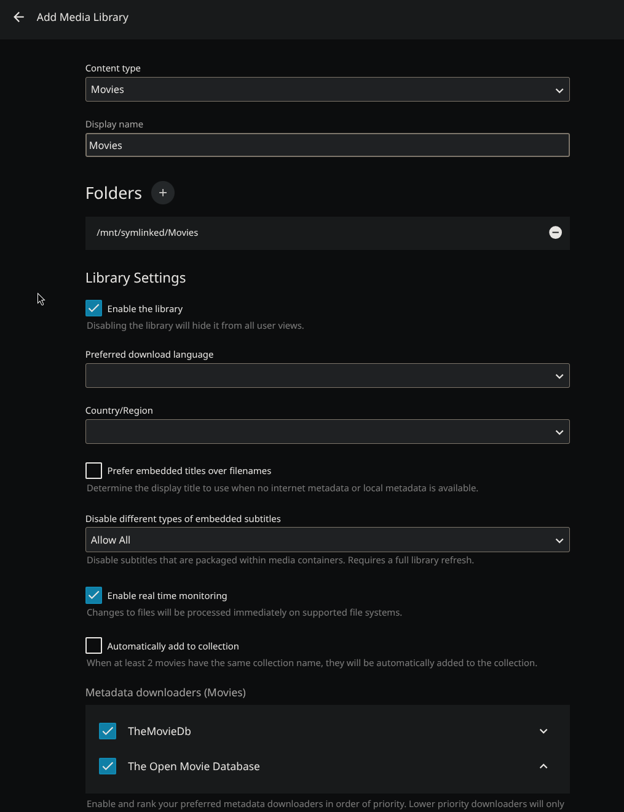
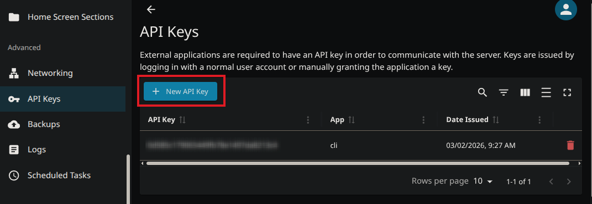

# Jellyfin

Jellyfin is a free, open-source alternative to Plex. CLI_Debrid supports Jellyfin for library management.

!!! tip "Jellyfin is recommended on Windows"
    If you're running CLI_Debrid on Windows with Symlinked/Local mode, use Jellyfin — Plex does not support symlinks on Windows.

---

## Prerequisites

- Jellyfin installed and running
- A working debrid mount ([Zurg + rclone](zurg.md) or [Decypharr](decypharr.md))
- The mount path accessible inside the Jellyfin container

---

## Step 1 — Expose the debrid mount to Jellyfin

Jellyfin requires symlink mode. You need to mount both the debrid storage and the symlink folder, and the container paths **must match cli_debrid exactly**.

| Host Path | Container Path |
|---|---|
| Your debrid mount (e.g. `/mnt/remotes/zurg`) | Must match cli_debrid exactly (e.g. `/media/mount`) |
| Your symlink folder (e.g. `/mnt/symlinks`) | Must match cli_debrid exactly (e.g. `/mnt/symlinked`) |

!!! warning "Paths must match cli_debrid exactly"
    Symlinks created by cli_debrid point to files inside the debrid mount using the container path. Jellyfin must mount both volumes at **identical container paths** to cli_debrid — otherwise symlinks will appear broken.

=== "Docker Compose"
    ```yaml
    services:
      jellyfin:
        image: lscr.io/linuxserver/jellyfin:latest
        container_name: jellyfin
        network_mode: bridge
        ports:
          - "8096:8096/tcp"
          - "7359:7359/udp"
        volumes:
          - /path/to/your/debrid/mount:/media/mount:ro    # e.g. /mnt/cache/zurg, /mnt/data/debrid — must match cli_debrid
          - /path/to/your/symlinks:/mnt/symlinked:ro       # e.g. /mnt/disk1/TVShows — must match cli_debrid
          - /path/to/jellyfin/appdata:/config:rw           # e.g. /mnt/cache/appdata/jellyfin
        environment:
          - TZ=America/New_York
          - PUID=0
          - PGID=0
          - UMASK=022
        restart: unless-stopped
    ```

    !!! warning "Unraid users"
        Use the actual pool path for the mount (e.g. `/mnt/cache/zurg` or `/mnt/downloadcache/zurg`), not `/mnt/user/zurg`. This avoids array startup issues.

=== "Unraid"
    Edit your Jellyfin docker template and add the path mapping above.

=== "Portainer / Dockge / Dockhand"
    Paste the same compose file from the Docker Compose tab into your stack editor and deploy.

    - **Portainer:** Stacks → Add Stack → paste → Deploy
    - **Dockge:** + Compose → paste → Deploy
    - **Dockhand:** Stacks → + Create → paste → Create & Start

=== "Windows"

    Jellyfin has a native Windows installer.

    1. Download from [jellyfin.org/downloads](https://jellyfin.org/downloads/)
    2. Run the installer
    3. Jellyfin will be available at `http://localhost:8096`

Restart Jellyfin after making this change.

---

## Step 2 — Add Debrid libraries in Jellyfin

1. In Jellyfin, go to **Dashboard → Libraries**
2. Click **Add Media Library**
3. For **Content Type**, select **Movies**
4. Name it `Movies-DB`
5. Add folder: `/data/movies`
6. Click **OK**

Repeat for TV Shows:

1. Add another library
2. **Content Type:** Shows
3. Name: `TV Shows-DB`
4. Folder: `/data/shows`



---

## Step 3 — Configure CLI_Debrid for Jellyfin

In CLI_Debrid, go to **Settings → Required Settings**:

| Setting | Value |
|---|---|
| **File Management** | Plex (Jellyfin uses the same setting) |
| **Media Server Type** | Jellyfin |
| **Jellyfin URL** | `http://YOUR_JELLYFIN_IP:8096` |
| **Jellyfin API Key** | See below |
| **Shows Libraries** | `TV Shows-DB` |
| **Movie Libraries** | `Movies-DB` |

### Getting your Jellyfin API key

1. In Jellyfin, go to **Dashboard → API Keys**
2. Click **+** to create a new key
3. Name it `cli_debrid`
4. Copy the generated key



---

## Troubleshooting

**New content not appearing in Jellyfin**

- Go to **Dashboard → Libraries** → click **Scan All Libraries**
- Or trigger a scan on just the Movies-DB or TV Shows-DB library

**Items showing with wrong metadata**

- In Jellyfin, right-click the item → **Identify** and search manually
