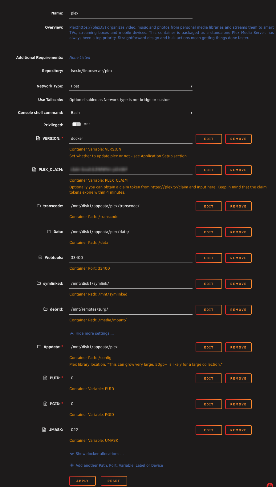
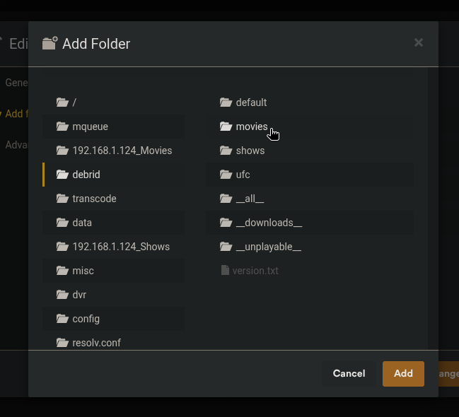
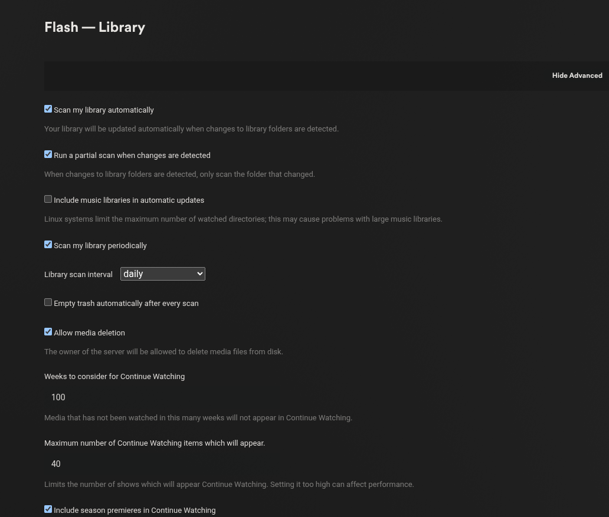

# Plex Setup

This guide covers adding your Debrid library to Plex so content downloaded through CLI_Debrid appears in your Plex server automatically.

!!! note "Mount required first"
    Your debrid library must be mounted before Plex can see it. Set up either [Zurg + rclone](zurg.md) or [Decypharr](decypharr.md) first.

---

## Prerequisites

- Plex Media Server installed and running
- A working debrid mount (Zurg + rclone or Decypharr) at your mount path
- The mount path accessible inside the Plex docker container

---

## Step 1 — Expose the debrid mount to Plex

The Plex docker container needs to be able to see your debrid mount and — if using symlink mode — your symlink folder. Add path mappings to your Plex docker:

| Mode | Host Path | Container Path |
|---|---|---|
| Both modes | Your debrid mount (e.g. `/mnt/remotes/zurg`) | Must match cli_debrid exactly (e.g. `/media/mount`) |
| Symlink mode only | Your symlink folder (e.g. `/mnt/symlinks`) | Must match cli_debrid exactly (e.g. `/mnt/symlinked`) |

!!! warning "Paths must match cli_debrid exactly"
    In symlink mode, symlinks created by cli_debrid point to files inside the debrid mount using the container path. Plex must mount both the debrid storage and symlink folder at **identical container paths** to cli_debrid — otherwise symlinks will appear broken.

=== "Unraid"
    Edit your Plex docker template and add the path mappings above.

    

=== "Docker Compose"
    ```yaml
    services:
      plex:
        image: lscr.io/linuxserver/plex:latest
        container_name: plex
        network_mode: host
        volumes:
          - /path/to/your/debrid/mount:/media/mount:ro    # e.g. /mnt/cache/zurg, /mnt/data/debrid — must match cli_debrid
          - /path/to/your/symlinks:/mnt/symlinked:ro       # e.g. /mnt/disk1/TVShows — symlink mode only, must match cli_debrid
          - /path/to/plex/appdata:/config:rw               # e.g. /mnt/cache/appdata/plex
          - /path/to/plex/transcode:/transcode:rw          # e.g. /mnt/cache/appdata/plex/transcode
          - /path/to/plex/data:/data:rw                    # e.g. /mnt/cache/appdata/plex/data
        environment:
          - TZ=America/New_York
          - VERSION=latest
          - PUID=0
          - PGID=0
          - UMASK=022
        restart: unless-stopped
        devices:
          - /dev/dri:/dev/dri                              # optional — hardware transcoding
    ```

    !!! warning "Unraid users"
        Use the actual pool path for the mount (e.g. `/mnt/cache/zurg` or `/mnt/downloadcache/zurg`), not `/mnt/user/zurg`. This avoids array startup issues.

=== "Portainer / Dockge / Dockhand"
    Paste the same compose file from the Docker Compose tab into your stack editor and deploy.

    - **Portainer:** Stacks → Add Stack → paste → Deploy
    - **Dockge:** + Compose → paste → Deploy
    - **Dockhand:** Stacks → + Create → paste → Create & Start

=== "Windows"

    Plex has a native Windows installer.

    1. Download from [plex.tv/media-server-downloads](https://www.plex.tv/media-server-downloads/)
    2. Run the installer and follow the setup wizard
    3. Plex will be available at `http://localhost:32400/web`

    !!! warning "Symlinks on Windows"
        Plex does **not** support symlinks on Windows. If using symlink mode, use Jellyfin instead.

Restart Plex after making this change.

---

## Step 2 — Add Debrid libraries

In Plex, go to **Settings → Manage → Libraries**.

You need to add **two** new libraries — one for Debrid movies, one for Debrid TV shows. These are separate from any existing local libraries you have.

### Add the Movies library

1. Click **Add Library**
2. Select type: **Movies**
3. Name it: `Movies-DB` (or any name you prefer)
4. Click **Next**
5. Click **Browse for media folder** and select `/data/movies`
6. Click **Add**



On the **Advanced** tab, configure:

- **Scanner:** Plex Movie Scanner
- **Agent:** Plex Movie
- ☑ Enable video preview thumbnails — **off** (reduces API calls)
- ☑ Empty trash automatically after every scan — **off**

Click **Add Library**.

### Add the TV Shows library

1. Click **Add Library**
2. Select type: **TV Shows**
3. Name it: `TV Shows-DB`
4. Add folder: `/data/shows`
5. Same Advanced settings as above

Click **Add Library**.

---

## Step 3 — Configure Plex library scan settings

Go to **Settings → Settings → Library** and enable:

| Setting | Value |
|---|---|
| **Scan my library automatically** | ☑ On |
| **Run a partial scan when changes are detected** | ☑ On |
| **Scan my library periodically** | ☑ On |
| **Allow media deletion** | ☑ On |



These settings ensure Plex picks up new content automatically. Zurg, Decypharr, and cli_debrid each handle library notifications via their own methods.

---

## Step 4 — Pin libraries to home screen (optional)

To see Debrid movies and TV shows in your Plex Home **Recently Added** section alongside your local content:

1. Go to your Plex Home page
2. In the right sidebar, click **More**
3. Find `Movies-DB` in the list, click the three dots → **Pin**
4. Repeat for `TV Shows-DB`

---

## Finding your Plex token

You'll need your Plex token for `plex_update.sh` in the Zurg setup.

1. Log in to [app.plex.tv](https://app.plex.tv) in your browser
2. Go to any media item → click the **⋮** menu → **Get Info**
3. Click **View XML** — a new tab opens
4. In the URL bar, find `X-Plex-Token=` and copy the value after the `=`

Alternatively:

1. Open your browser's Developer Tools (F12)
2. Go to the Console tab
3. Paste: `window.localStorage.getItem("myPlexAccessToken")`
4. Press Enter — your token is printed

---

## Troubleshooting

**New content not appearing in Plex**

- Manually trigger a scan: go to your `Movies-DB` or `TV Shows-DB` library → click **⋮** → **Scan Library Files**
- After one manual scan, automatic scanning usually takes over

**Library folder says "empty" or "no media found"**

- Verify the mount has content: browse to your mount path (e.g. `/mnt/user/zurg/movies`) on your server
- Check the path mapping in your Plex docker — container `/data` must point to your debrid mount

**Items appear with wrong metadata**

- Right-click the item in Plex → **Fix Incorrect Match** and search manually
- This is normal for some non-English or obscure titles
