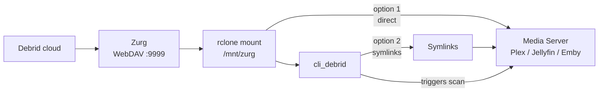

# Zurg + rclone

Zurg connects to your Real-Debrid account and exposes your cloud library as a WebDAV server. rclone then mounts that WebDAV share as a local folder on your system — so Plex can browse and stream it as if it were local storage.



!!! note "Nothing is stored locally"
    The rclone mount is a virtual filesystem. No files are downloaded to your server — everything streams directly from Real-Debrid when Plex plays it.

---

## Prerequisites

- A paid debrid service account (e.g. Real-Debrid, AllDebrid, Torbox)
- Your debrid API token — found in your debrid provider's account settings
- **rclone** installed (binary method only — Docker method includes rclone as a container)

---

## Installation method

=== "Docker (recommended)"

    The Docker method runs Zurg and rclone as containers. No binary to download, no systemd services — just a compose file.

    ### Step 1 — Create a folder

    ```bash
    mkdir -p ~/zurg && cd ~/zurg
    ```

    ### Step 2 — Create config.yml

    ```yaml title="config.yml"
    zurg: v1
    token: YOUR_REAL_DEBRID_API_TOKEN    # (1)
    retain_rd_torrent_name: true
    retain_folder_name_extension: true
    enable_repair: true
    auto_delete_rar_torrents: true
    check_for_changes_every_secs: 10
    on_library_update: sh plex_update.sh "$@"    # (2)

    directories:
      shows:
        group_order: 20
        group: media
        filters:
          - has_episodes: true

      movies:
        group_order: 30
        group: media
        only_show_the_biggest_file: true
        filters:
          - regex: /.*/
    ```

    1. Paste your Real-Debrid API token here
    2. Triggers a Plex library scan when new content arrives — see [plex_update.sh](#plex_updatesh) below

    ### Step 3 — Create rclone.conf

    ```ini title="rclone.conf"
    [zurg]
    type = webdav
    url = http://zurg:9999/dav    # (1)
    vendor = other
    pacer_min_sleep = 0
    ```

    1. `zurg` refers to the Zurg container by its service name — this works automatically inside Docker Compose networking. No IP needed.

    ### Step 4 — Create plex_update.sh

    ```bash title="plex_update.sh"
    #!/bin/bash

    plex_url="http://YOUR_PLEX_IP:32400"    # (1)
    token="YOUR_PLEX_TOKEN"                  # (2)
    zurg_mount="/mnt/zurg"                   # (3)

    section_ids=$(curl -sLX GET "$plex_url/library/sections" \
      -H "X-Plex-Token: $token" | \
      xmllint --xpath "//Directory/@key" - | \
      grep -o 'key="[^"]*"' | awk -F'"' '{print $2}')

    for arg in "$@"
    do
        parsed_arg="${arg//\\}"
        modified_arg="$zurg_mount/$parsed_arg"
        for section_id in $section_ids
        do
            curl -G -H "X-Plex-Token: $token" \
              --data-urlencode "path=$modified_arg" \
              $plex_url/library/sections/$section_id/refresh
        done
    done
    ```

    1. Your Plex server IP and port
    2. See [Finding your Plex token](plex.md#finding-your-plex-token)
    3. Must match the host path in the rclone volume mount below

    ### Step 5 — Create docker-compose.yml

    ```yaml title="docker-compose.yml"
    services:
      zurg:
        image: ghcr.io/debridmediamanager/zurg-testing:latest
        container_name: zurg
        restart: unless-stopped
        healthcheck:
          test: curl -f localhost:9999/dav/version.txt || exit 1
        ports:
          - "9999:9999"
        volumes:
          - ./config.yml:/app/config.yml
          - ./plex_update.sh:/app/plex_update.sh
          - zurgdata:/app/data

      rclone:
        image: rclone/rclone:latest
        container_name: rclone
        restart: unless-stopped
        environment:
          TZ: America/New_York    # (1)
          PUID: 1000
          PGID: 1000
        volumes:
          - /mnt/zurg:/data:rshared    # (2)
          - ./rclone.conf:/config/rclone/rclone.conf
        cap_add:
          - SYS_ADMIN
        security_opt:
          - apparmor:unconfined
        devices:
          - /dev/fuse:/dev/fuse:rwm
        depends_on:
          zurg:
            condition: service_healthy
            restart: true
        command: "mount zurg: /data --allow-other --allow-non-empty --dir-cache-time 10s --vfs-cache-mode full"

    volumes:
      zurgdata:
    ```

    1. Set your local timezone
    2. Change `/mnt/zurg` to wherever you want the mount to appear on your host

    !!! warning "Unraid users"
        Use the actual pool path for the mount volume, e.g. `/mnt/cache/zurg` or `/mnt/downloadcache/zurg` — not `/mnt/user/zurg`. This avoids array startup issues.

    ### Step 6 — Set permissions and start

    ```bash
    chmod +x plex_update.sh
    docker compose up -d
    docker compose logs -f
    ```

    You should see Zurg connect to Real-Debrid and rclone mount successfully.

    ### Step 7 — Verify

    Check the mount has content:

    ```bash
    ls /mnt/zurg
    ```

    You should see `movies/` and `shows/` directories populated with your Real-Debrid library.

    Also confirm the Zurg status page loads:
    ```
    http://YOUR_SERVER_IP:9999
    ```

=== "Binary"

    The binary method runs Zurg as a process directly on your host. Useful on Unraid (User Scripts) or any Linux system without Docker.

    ### Step 1 — Create the appdata folder

    === "Unraid"
        ```
        /mnt/cache/appdata/zurg/
        ```

    === "Linux"
        ```bash
        mkdir -p ~/zurg && cd ~/zurg
        ```

    ### Step 2 — Download Zurg

    1. Go to [zurg-testing releases](https://github.com/debridmediamanager/zurg-testing/releases) on GitHub
    2. Download the latest release for your platform:
        - Linux x64: `zurg-v0.9.xxx-final-linux-amd64.zip`
        - Linux ARM64: `zurg-v0.9.xxx-final-linux-arm64.zip`
    3. Extract the zip — you get a single binary named `zurg`
    4. Place it in your appdata folder

    ### Step 3 — Create config.yml

    ```yaml title="config.yml"
    zurg: v1
    token: YOUR_REAL_DEBRID_API_TOKEN    # (1)
    retain_rd_torrent_name: true
    retain_folder_name_extension: true
    enable_repair: true
    auto_delete_rar_torrents: true
    check_for_changes_every_secs: 10
    on_library_update: sh plex_update.sh "$@"    # (2)

    directories:
      shows:
        group_order: 20
        group: media
        filters:
          - has_episodes: true

      movies:
        group_order: 30
        group: media
        only_show_the_biggest_file: true
        filters:
          - regex: /.*/
    ```

    1. Paste your Real-Debrid API token here
    2. Triggers a Plex library scan when new content arrives

    ### Step 4 — Create rclone.conf

    ```ini title="rclone.conf"
    [zurg-wd]
    type = webdav
    url = http://YOUR_SERVER_IP:9999/dav    # (1)
    vendor = other
    pacer_min_sleep = 0
    ```

    1. Replace `YOUR_SERVER_IP` with the IP of the machine running Zurg

    ### Step 5 — Create plex_update.sh

    ```bash title="plex_update.sh"
    #!/bin/bash

    plex_url="http://YOUR_PLEX_IP:32400"    # (1)
    token="YOUR_PLEX_TOKEN"                  # (2)
    zurg_mount="/path/to/your/zurg/mount"    # (3) e.g. /mnt/user/zurg, /mnt/downloadcache/zurg

    section_ids=$(curl -sLX GET "$plex_url/library/sections" \
      -H "X-Plex-Token: $token" | \
      xmllint --xpath "//Directory/@key" - | \
      grep -o 'key="[^"]*"' | awk -F'"' '{print $2}')

    for arg in "$@"
    do
        parsed_arg="${arg//\\}"
        modified_arg="$zurg_mount/$parsed_arg"
        for section_id in $section_ids
        do
            curl -G -H "X-Plex-Token: $token" \
              --data-urlencode "path=$modified_arg" \
              $plex_url/library/sections/$section_id/refresh
        done
    done
    ```

    1. Your Plex server IP and port
    2. See [Finding your Plex token](plex.md#finding-your-plex-token)
    3. The path where the rclone mount will appear — must match what Plex can see

    ### Step 6 — Set permissions

    ```bash
    chmod +x zurg
    chmod +x plex_update.sh
    ```

    ### Step 7 — Start Zurg and rclone

    === "Unraid (User Scripts)"

        Create three User Scripts under **Settings → User Scripts**:

        **Script 1 — Start Zurg** (Schedule: At Startup of Array)
        ```bash
        #!/bin/bash
        cd /mnt/user/appdata/zurg
        chmod 777 zurg
        /mnt/user/appdata/zurg/./zurg &
        ```

        !!! warning "Always use Run in Background"
            When running manually from User Scripts, always click **RUN IN BACKGROUND**.

        **Script 2 — Mount with rclone** (Schedule: At Startup of Array)
        ```bash
        #!/bin/bash
        sleep 10
        rclone mount zurg-wd: /path/to/your/zurg/mount \  # e.g. /mnt/downloadcache/zurg, /mnt/cache/zurg
          --dir-cache-time 20s \
          --config=/mnt/user/appdata/zurg/rclone.conf \
          --allow-other \
          --allow-non-empty \
          --gid 100 \
          --uid 99 \
          --daemon
        ```

        !!! note "Mount path"
            Use the actual pool path (e.g. `/mnt/downloadcache/zurg`), not the user share path. This ensures the mount works even if the array is still starting.

        **Script 3 — Unmount on shutdown** (Schedule: At Stopping of Array)
        ```bash
        #!/bin/bash
        pkill zurg
        sleep 2
        fusermount -uz /path/to/your/zurg/mount  # must match the path used in Script 2
        ```

        !!! danger "This script is critical"
            Without this, stopping the array causes a "Retry un-mounting disks" error and forces an unclean shutdown + parity check.

    === "Linux (systemd)"

        Create a systemd service for Zurg:

        ```ini title="/etc/systemd/system/zurg.service"
        [Unit]
        Description=Zurg Real-Debrid WebDAV
        After=network.target

        [Service]
        WorkingDirectory=/opt/zurg
        ExecStart=/opt/zurg/zurg
        Restart=always

        [Install]
        WantedBy=multi-user.target
        ```

        ```bash
        systemctl enable zurg
        systemctl start zurg
        ```

        Then mount with rclone:
        ```bash
        rclone mount zurg-wd: /mnt/zurg \
          --dir-cache-time 20s \
          --config=/opt/zurg/rclone.conf \
          --allow-other \
          --allow-non-empty \
          --daemon
        ```

    ### Step 8 — Verify

    Check the Zurg status page loads:
    ```
    http://YOUR_SERVER_IP:9999
    ```

    Browse to your mount path — you should see `movies/` and `shows/` folders populated with your library.

=== "Portainer / Dockge / Dockhand"

    Follow Steps 1–4 from the **Docker (recommended)** tab to create your config files, then paste the compose file into your stack editor and deploy.

    - **Portainer:** Stacks → Add Stack → paste → Deploy
    - **Dockge:** + Compose → paste → Deploy
    - **Dockhand:** Stacks → + Create → paste → Create & Start

    !!! warning "Unraid users"
        Use the actual pool path for the mount volume, e.g. `/mnt/cache/zurg` or `/mnt/downloadcache/zurg` — not `/mnt/user/zurg`. This avoids array startup issues.

=== "Windows"

    Both Zurg and rclone have native Windows binaries.

    **Zurg**

    1. Go to [zurg-testing releases](https://github.com/debridmediamanager/zurg-testing/releases) on GitHub
    2. Download the latest `zurg-...-windows-amd64.zip`
    3. Extract and place `zurg.exe` in a permanent folder (e.g. `C:\zurg\`)
    4. Create your `config.yml` in the same folder — see Steps 2–4 in the **Binary** tab for the config format
    5. Run `zurg.exe` from a terminal or create a scheduled task to run it at startup

    **rclone**

    1. Download from [rclone.org/downloads](https://rclone.org/downloads/)
    2. Create your `rclone.conf` pointing at Zurg's WebDAV — see Step 4 in the **Binary** tab
    3. Run the rclone mount command from a terminal or wrap it as a scheduled task

---

## Webhook — Symlink mode (items added outside cli_debrid)

If you add torrents directly to your debrid account outside of cli_debrid (e.g. via Debrid Media Manager), Zurg can notify cli_debrid to pick them up and create symlinks automatically.

Add the following to your `config.yml`:

```yaml
on_library_update: sh cli_update.sh "$@"
```

Then create `cli_update.sh` alongside your `config.yml`:

```bash title="cli_update.sh"
#!/bin/bash

CLI_DEBRID_URL="http://YOUR_CLI_DEBRID_IP:5000"    # (1)
RCLONE_MOUNT="/mnt/zurg"                            # (2)
MAX_ATTEMPTS=25

for arg in "$@"; do
    folder="$RCLONE_MOUNT/${arg//\\//}"
    attempt=0
    while [ $attempt -lt $MAX_ATTEMPTS ]; do
        if [ -d "$folder" ] && [ "$(ls -A "$folder")" ]; then
            curl -s -X POST "$CLI_DEBRID_URL/webhook/rclone" \
              -H "Content-Type: application/json" \
              -d "{\"path\": \"$arg\"}"
            break
        fi
        attempt=$((attempt + 1))
        sleep 10
    done
done
```

1. Your cli_debrid URL and port
2. Must match your rclone mount path

The script waits for the folder to exist and contain at least one file before notifying cli_debrid — retrying up to 25 times (~4 minutes). cli_debrid will then create the symlink and add the item to your library.

```bash
chmod +x cli_update.sh
```

!!! note
    If you also want to trigger Plex scans, you can call both `plex_update.sh` and `cli_update.sh` from `on_library_update`, or combine the logic into one script.

---

## Troubleshooting

**Zurg status page not loading**

- Verify Zurg is running: `ps aux | grep zurg` (binary) or `docker compose logs zurg` (Docker)
- Check the API token in `config.yml` is correct (no extra spaces)

**Mount folder is empty**

- Verify rclone is running: `ps aux | grep rclone` (binary) or `docker compose logs rclone` (Docker)
- Check `rclone.conf` has the correct URL
- Run the rclone mount command manually to see any errors

**"Transport endpoint is not connected" error**

The mount was disconnected. Unmount and remount:
```bash
fusermount -uz /your/mount/path
# then run the rclone mount command again
```

**Docker: rclone container exits immediately**

- Confirm `/dev/fuse` exists on the host: `ls -la /dev/fuse`
- Confirm `SYS_ADMIN` capability and `apparmor:unconfined` are in your compose file
- On some systems you may need to load the fuse kernel module: `modprobe fuse`

---

## Next steps

- [Configure Plex](plex.md) to add libraries pointing at the Zurg mount
- [Configure cli_debrid](../getting-started/configure.md) with the correct Original Files Path
