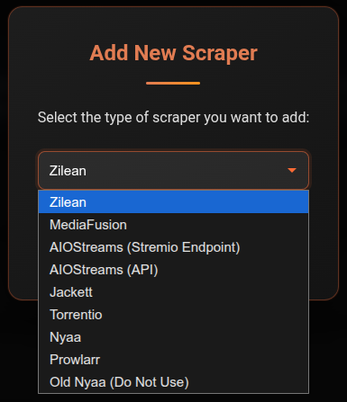

# Scrapers

Scrapers are the search engines CLI_Debrid uses to find torrents for your wanted content. You need at least one scraper configured and enabled.

---

## Available scrapers

| Scraper | Best for | Setup required |
|---|---|---|
| [Zilean](zilean.md) | Fast debrid cache lookups, upgrades | URL only |
| [Torrentio](torrentio.md) | General movies and TV | URL only |
| [MediaFusion](mediafusion.md) | Configurable multi-source | Web configurator |
| [AIOStreams](aiostreams.md) | Aggregates multiple Stremio addons via one endpoint | URL or API |
| [Jackett](jackett.md) | Any tracker via one interface | Self-hosted |
| [Prowlarr](prowlarr.md) | Multiple trackers, *arr ecosystem | Self-hosted |
| [Nyaa](nyaa.md) | Anime | No setup |

!!! tip "Recommended starting point"
    Start with **Zilean** + **Torrentio**. Zilean checks what's already in your debrid cache (instant, no download needed). Torrentio covers a broad range of content. Add more scrapers if you need specific trackers or better anime coverage.

---

## How scrapers work together

When CLI_Debrid searches for a title, it queries **all enabled scrapers simultaneously**. Results from all scrapers are combined into one pool, then ranked by your [Version](../configuration/versions.md) quality score. The highest-scoring result that passes all your filters wins.

---

## Adding a scraper

1. Go to **Settings → Scrapers**
2. Click **Add Scraper** and select the type
3. Fill in the required fields (URL, API key, etc.)
4. Toggle **Enabled** on
5. Click **Save Settings**

