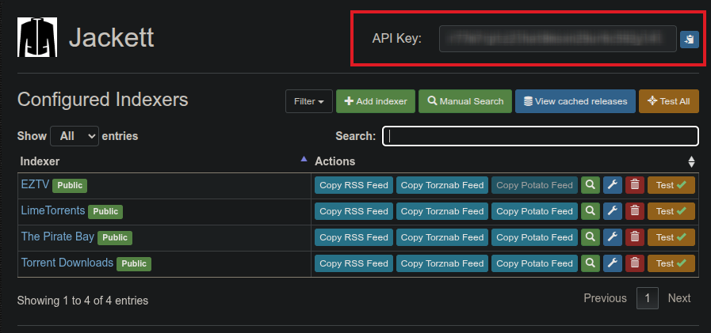
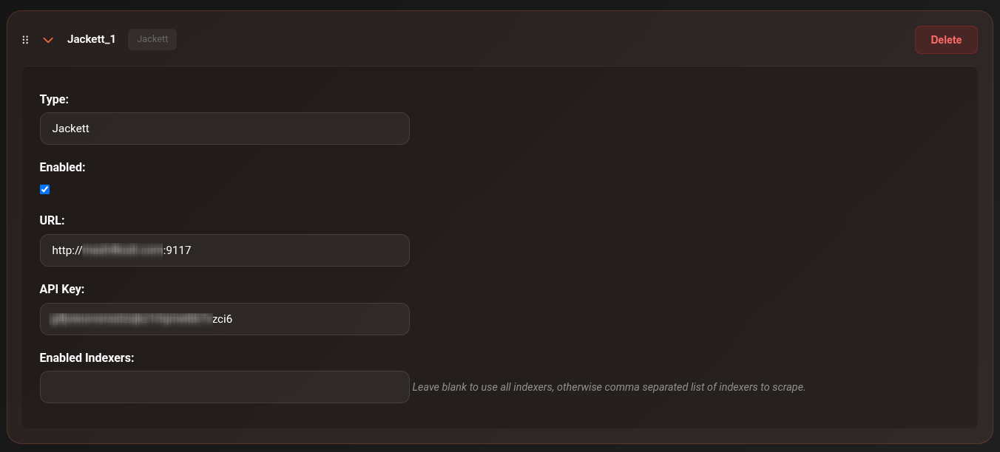

# Jackett

Jackett acts as a proxy between CLI_Debrid and hundreds of private and public torrent trackers. If a tracker isn't supported by Torrentio or MediaFusion, Jackett is how you add it.

---

## Prerequisites

- Jackett installed and running on your network
- At least one tracker configured in Jackett

---

## Install Jackett

=== "Docker Compose"
    ```yaml
    services:
      jackett:
        image: lscr.io/linuxserver/jackett:latest
        container_name: jackett
        ports:
          - "9117:9117"
        volumes:
          - ./config:/config
          - ./downloads:/downloads
        environment:
          - TZ=America/New_York
        restart: unless-stopped
    ```

=== "Unraid"
    Search for `Jackett` in Community Applications and install the lscr.io/linuxserver/jackett template.

Access Jackett at `http://YOUR_SERVER_IP:9117`.

---

## Configure Jackett

1. Open the Jackett web UI
2. Click **Add Indexer** and add the trackers you want
3. Note your **API Key** — shown at the top right of the Jackett dashboard

    

---

## Add Jackett to CLI_Debrid

1. Go to **Settings → Scrapers**
2. Click **Add Scraper** → select **Jackett**
3. Fill in:

    | Field | Value |
    |---|---|
    | **URL** | `http://YOUR_JACKETT_IP:9117` |
    | **API Key** | Copied from the Jackett dashboard |
    | **Seeders Only** | ☑ Recommended — skip results with no seeders |

4. Toggle **Enabled** on
5. Click **Save Settings**



---

## Notes

- Jackett searches all your configured indexers simultaneously
- Results include both public and private tracker results depending on your indexers
- Private tracker results require your account credentials to be configured in Jackett
- Enable **Seeders Only** to avoid dead torrents

---

## Troubleshooting

**Jackett returning no results**

- Check the Connections page — is Jackett reachable from CLI_Debrid?
- Verify the API key is correct
- In Jackett, manually test an indexer search to confirm it's working
- Check that at least one indexer is configured in Jackett
