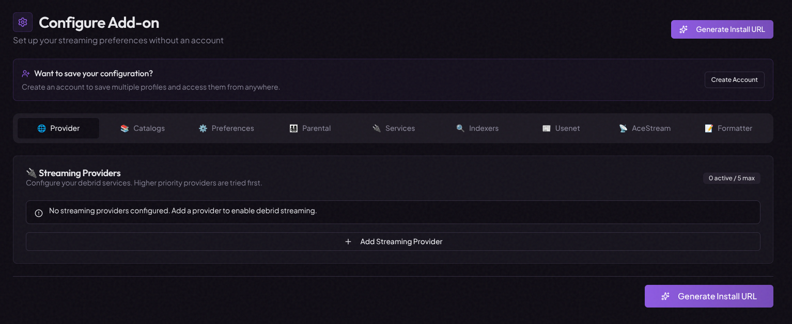
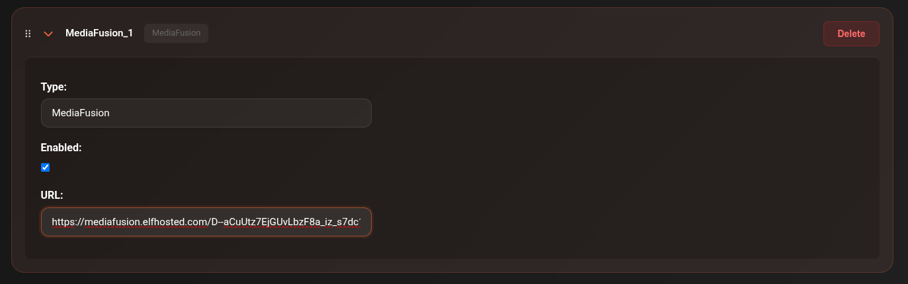

# MediaFusion

MediaFusion is a configurable torrent source aggregator. Unlike Torrentio, you configure it through a web UI before adding it to CLI_Debrid — this lets you pick exactly which sources, resolutions, and providers to include.

---

## Step 1 — Generate your MediaFusion URL

1. Go to [mediafusion.elfhosted.com/configure](https://mediafusion.elfhosted.com/configure)

    

2. Configure your preferences:

    | Setting | Recommendation |
    |---|---|
    | **Streaming providers** | Select your debrid provider (Real-Debrid, etc.) |
    | **Quality** | Select 1080p and/or 4K depending on your versions |
    | **Catalogs** | Enable the content types you want (Movies, TV) |

3. Scroll to the bottom and click **Install** or **Copy URL** — this copies your personalised MediaFusion configuration URL to your clipboard

    

---

## Step 2 — Add to CLI_Debrid

1. Go to **Settings → Scrapers**
2. Click **Add Scraper** → select **MediaFusion**
3. Paste the URL you copied from the MediaFusion configurator into the **URL** field
4. Toggle **Enabled** on
5. Click **Save Settings**

---

## Updating your configuration

If you want to change your MediaFusion settings (e.g. add more sources or change quality):

1. Go back to [mediafusion.elfhosted.com/configure](https://mediafusion.elfhosted.com/configure)
2. Adjust your settings
3. Copy the new URL
4. In CLI_Debrid, edit the MediaFusion scraper and replace the URL
5. Save

---

## Notes

- MediaFusion supports Real-Debrid, AllDebrid, Premiumize, Torbox, and Debrid-Link
- You can run multiple MediaFusion scrapers with different configurations (e.g. one for 1080p, one for 4K)
- The URL contains your debrid credentials encoded — do not share it publicly

---

## Troubleshooting

**No results from MediaFusion**

- Verify the URL is complete and was copied correctly (it should be long — over 100 characters)
- Check the Connections page to see if MediaFusion is reachable
- Regenerate the URL from the configurator and update the scraper

**Wrong quality results**

- Regenerate your URL with different quality settings selected
