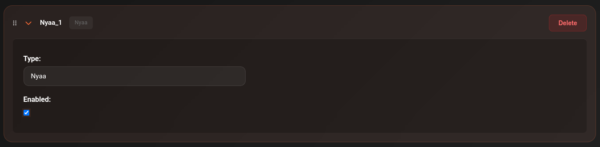

# Nyaa

Nyaa is the primary public torrent tracker for anime content. CLI_Debrid has a built-in Nyaa scraper — no external service required.

---

## Setup

1. Go to **Settings → Scrapers**
2. Click **Add Scraper** → select **Nyaa**
3. No additional configuration needed — Nyaa is a public tracker
4. Toggle **Enabled** on
5. Click **Save Settings**

---

## OldNyaa

CLI_Debrid also supports **OldNyaa** — a legacy Nyaa index useful for older anime titles that may not appear in the current Nyaa index. Add it the same way if you need older anime content.

---

## Notes

- Enable Nyaa alongside your other scrapers for anime content — don't use it as your only scraper
- Nyaa results are typically fansubs or raw releases — use your [Version settings](../configuration/versions.md) to filter to your preferred language/subtitle style
- For better anime title matching, enable **Use Alternative Titles** in your Version settings — this helps match anime that uses different romanisations

---

## Tips for anime

- Set **Anime Filter Mode** to `Anime Only` in a dedicated anime Version profile
- Enable **Enable Spanish Episode Parsing** if you watch Spanish-dubbed anime
- Lower the **Similarity Threshold (Anime)** in your Version to `0.75`–`0.80` — anime titles often vary between sources
