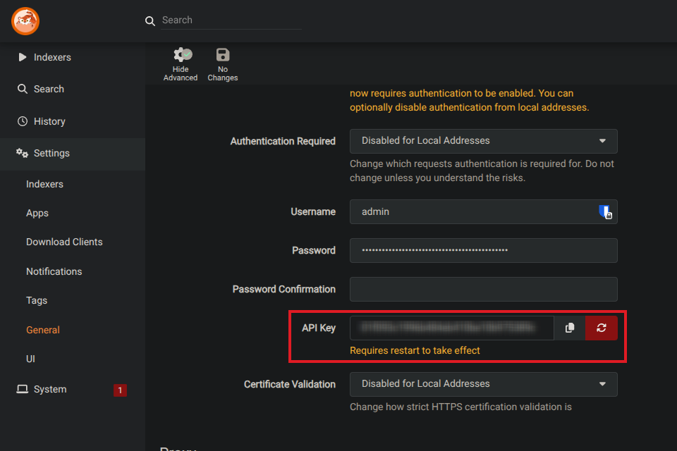

# Prowlarr

Prowlarr is an indexer manager that integrates with the *arr ecosystem (Radarr, Sonarr, etc.) and also works standalone with CLI_Debrid. It's an alternative to Jackett with a more modern UI and native *arr sync.

---

## Prerequisites

- Prowlarr installed and running
- At least one indexer configured in Prowlarr

---

## Install Prowlarr

=== "Docker Compose"
    ```yaml
    services:
      prowlarr:
        image: lscr.io/linuxserver/prowlarr:latest
        container_name: prowlarr
        ports:
          - "9696:9696"
        volumes:
          - ./config:/config
        environment:
          - TZ=America/New_York
        restart: unless-stopped
    ```

=== "Unraid"
    Search for `Prowlarr` in Community Applications and install the lscr.io/linuxserver/prowlarr template.

Access Prowlarr at `http://YOUR_SERVER_IP:9696`.

---

## Get your Prowlarr API key

1. Open Prowlarr
2. Go to **Settings → General**
3. Copy the **API Key**



---

## Add Prowlarr to CLI_Debrid

1. Go to **Settings → Scrapers**
2. Click **Add Scraper** → select **Prowlarr**
3. Fill in:

    | Field | Value |
    |---|---|
    | **URL** | `http://YOUR_PROWLARR_IP:9696` |
    | **API Key** | Copied from Prowlarr → Settings → General |

4. Toggle **Enabled** on
5. Click **Save Settings**

---

## Notes

- Prowlarr and Jackett serve the same purpose — you don't need both
- Prowlarr has better UI and native sync with Radarr/Sonarr if you use those
- Jackett supports more obscure indexers if you need them
