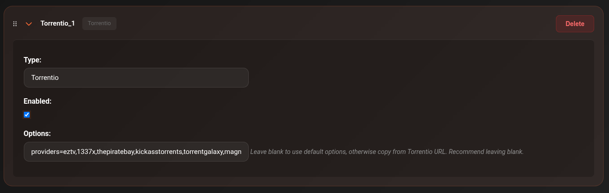

# Torrentio

Torrentio is a torrent metadata API that aggregates results from multiple public sources. It covers a broad range of movies and TV shows and is a reliable fallback when content isn't found in the debrid cache via Zilean.

---

## Setup

1. Go to **Settings → Scrapers**
2. Click **Add Scraper** → select **Torrentio**
3. Set the **URL**:

    === "Public instance"
        ```
        https://torrentio.strem.fun
        ```

    === "Self-hosted / Knightcrawler"
        ```
        http://YOUR_SERVER_IP:PORT
        ```

4. Toggle **Enabled** on
5. Click **Save Settings**



---

## Notes

- Torrentio is a public service with no authentication required
- Results include both cached and uncached torrents — CLI_Debrid will filter based on your [Uncached Content Handling](../configuration/versions.md#uncached-content) setting
- For better results on anime, use [Nyaa](nyaa.md) alongside Torrentio

---

## Troubleshooting

**No results from Torrentio**

- Check the Connections page
- The public Torrentio URL is occasionally rate-limited — try again after a few minutes
- Consider self-hosting [Knightcrawler](https://github.com/knightcrawler-stremio/knightcrawler) for a private instance
