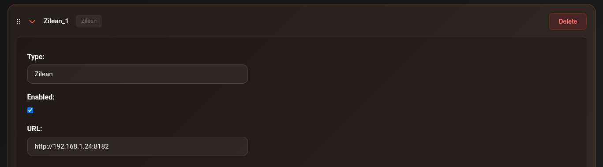

# Zilean

Zilean is a debrid cache index — it knows what's already cached on your debrid provider without you having to add and check each torrent. This makes it extremely fast and is the primary reason items appear in your library almost instantly.

!!! tip "Use Zilean first"
    Zilean should always be your first-priority scraper. If content is in the debrid cache, Zilean finds it in milliseconds. Other scrapers are fallbacks for content not yet cached.

---

## How it works

Zilean indexes hashes that are cached on Real-Debrid (and other providers). When CLI_Debrid searches for a title, Zilean returns results that are **guaranteed to be instantly available** — no waiting for a download.

---

## Setup

1. Go to **Settings → Scrapers**
2. Click **Add Scraper** → select **Zilean**
3. Set the **URL**:

    === "Public instance"
        ```
        https://zileanfortheweebs.midnightignite.me
        ```
        Free public instance. No account required.

    === "Self-hosted"
        Enter your own Zilean instance URL, e.g.:
        ```
        http://192.168.1.10:8182
        ```
        See the [Zilean GitHub](https://github.com/iPromKnight/zilean) for self-hosting instructions.

4. Toggle **Enabled** on
5. Click **Save Settings**



---

## Upgrade Hub — Direct DB connection

The [Upgrade Hub](../features/upgrade-hub.md) can connect directly to Zilean's PostgreSQL database for fast bulk upgrade scanning instead of going through the API. This is significantly faster for large libraries.

Enable under **Settings → Scrapers → Zilean → Enable DB Upgrades**:

| Field | Default | Description |
|---|---|---|
| **Enable DB Upgrades** | Off | Connect directly to the Zilean PostgreSQL database for fast bulk upgrade scanning |
| **Host** | _(derived from URL)_ | Auto-populated from your Zilean URL — read-only |
| **Port** | `5432` | PostgreSQL port |
| **Database Name** | `zilean` | Name of the Zilean database |
| **Username** | `postgres` | Database username |
| **Password** | — | Database password |

!!! note "Self-hosted only"
    Direct DB connection requires a self-hosted Zilean instance with PostgreSQL accessible on your network. This does not work with the public elfhosted instance.

---

## Troubleshooting

**Zilean returning no results**

- Check the Connections page — is Zilean showing as reachable?
- The public elfhosted URL changes occasionally — check the CLI_Debrid Discord for the current URL
- Test with the Scraper Tester: **Tools → Tester** — run a scrape and see if Zilean results appear
